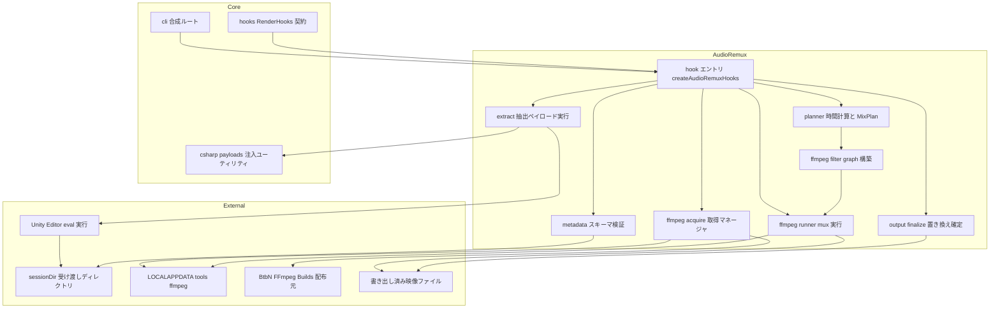
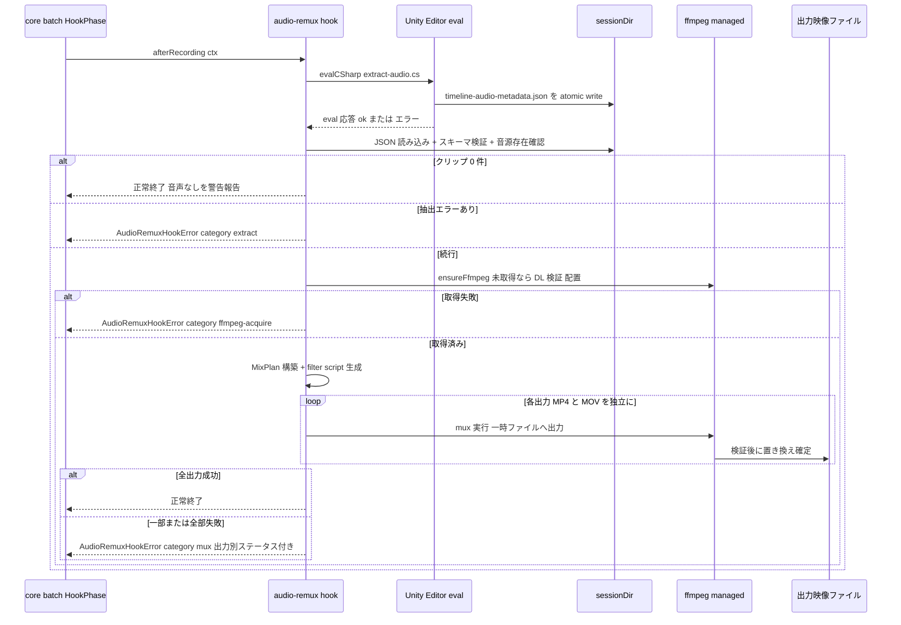
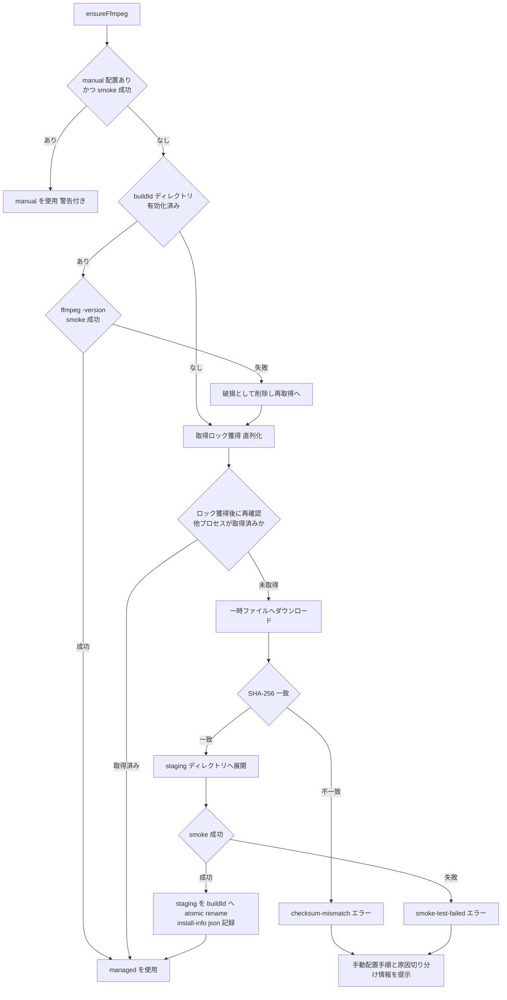

# Technical Design Document: timeline-audio-remux

## Overview

**Purpose**: timeline-audio-remux は、Unity Timeline（ControlTrack による入れ子構造を含む）の全階層 AudioTrack から再生情報を eval 実行の C# で抽出し、unity-render-core が書き出した無音映像に対して、ツール管理の ffmpeg（初回自動ダウンロード）で複数音源をブレンド・mux する機能を提供する。Unity Editor 再生時のミリ秒単位のランダムな音ズレ（per plan G-10）を根本回避する、本ツールの核心的差別化機能である。

**Users**: unity-render-core の `render` コマンド利用者が、追加設定なしで「音声合成済みの最終映像」を受け取る。本機能は独立コマンドではなく、`RenderHooks.afterRecording` に登録されるフックモジュールとして Scene 書き出し成功ごとに自動実行される。

**Impact**: unity-render-core と同一コードベース・同一 .exe に `src/audio-remux/` レイヤを追加する。unity-render-core 本体への変更は「合成ルート（cli）でのフック登録」「C# パラメータ注入ユーティリティの公開」「ツール管理ディレクトリパスの追加」の 3 点に限定する。

### Goals

- ルート Timeline から多段ネストの子 Timeline まで、全階層 AudioTrack のクリップ再生情報（元ファイルパス・ルート基準絶対開始時刻・clipIn・クリップ音量・再生速度・トラック音量/ミュート・ループ）を抽出する
- 抽出情報から ffmpeg filter graph を構築し、複数音源のブレンド・変速・ループ・イン/アウト点整合を経て、MP4 / MOV(ProRes) の両出力へ映像無劣化（`-c:v copy`）で mux する
- ffmpeg をバージョン固定 URL + SHA-256 検証で初回自動ダウンロードし、以後オフラインでも PATH 非依存で動作する（D-3 / D-4）
- 音声合成失敗時も無音映像を保全し、「映像成功・音声失敗」を unity-render-core の成否報告で区別可能にする
- 時間計算・filter graph 構築・スキーマ検証・取得マネージャを Unity 非依存の純 TypeScript として単体テスト可能にする

### Non-Goals

- Scene 内に直接置かれた AudioSource、AudioTrack 以外の発音（スクリプト再生・イベント SE）、サラウンド/空間音響・パンの再現（requirements Out of scope）
- クリップのフェードイン/アウトの再現（D-1 で初期スコープ外）
- 音声コーデック・サンプルレートのユーザー設定項目化（D-6: コンテナ別自動選択のみ）
- 外部プラグインとしての配布（unity-render-core 同一 .exe 内の in-process フックのみ）
- Editor 終了と ffmpeg 処理の並列化（初期リリースはフックフェーズ内で直列実行。6.5 は「Editor プロセス非依存」の意味で満たす）

## Boundary Commitments

### This Spec Owns

- 音声メタデータ JSON スキーマの定義・バージョニング・検証（unity-render-core はスキーマに関知しない）
- フックで実行する音声情報抽出 C#（`extract-audio.cs`）と、その sessionDir への atomic write 契約
- 時間正規化（祖先 timeScale 累積 → 速度 → clipIn → ループ → イン点 → アウト点）の数式と境界挙動
- ffmpeg の取得・検証・管理（ピン止めマニフェスト、ツール管理ディレクトリ、ライセンス記録）
- filter graph 構築・コンテナ別コーデックマトリクス・mux 実行・最終成果物の確定（置き換え方式）
- 音声処理の失敗区分（extract / ffmpeg-acquire / mux）の構造化と unity-render-core への伝搬形式

### Out of Boundary

- フック地点・`RenderHandoff` / `HookContext` の契約定義（unity-render-core 14.1–14.4 の責務。本 Spec は消費者）
- 映像書き出し・出力パス確定・Editor ライフサイクル・原状復帰（unity-render-core の責務）
- sessionDir の生成・削除タイミングの実装（unity-render-core の責務。本 Spec は下記「sessionDir 利用契約」で利用条件のみ確定する）
- ffmpeg 自体の不具合修正・フォーク、映像ストリームの再エンコード

### Allowed Dependencies

- unity-render-core の `hooks`（`RenderHooks` / `HookContext` / `RenderHandoff`）— 唯一の統合点
- unity-render-core の `shared`（`Result` / logger / paths）と `csharp-payloads` のパラメータ注入ユーティリティ
- ツール管理ディレクトリ `%LOCALAPPDATA%\unity-render-core\tools\`（sessions とは別系統）
- BtbN FFmpeg-Builds の GitHub Releases（ピン止めタグの zip + SHA-256）— 初回ダウンロード時のみ
- Unity Editor へのアクセスは `HookContext.evalCSharp` 経由の読み取り専用抽出に限定（プロジェクト非介入。8.4）

### Revalidation Triggers

- unity-render-core 側 `RenderHandoff` / `HookContext` のシェイプ変更（→ 本 Spec 再検証必須。core 側 Revalidation Trigger と対）
- 音声メタデータ JSON スキーマの破壊的変更（`schemaVersion` 更新）
- 最終成果物の配置方式（置き換え方式）の変更（→ ユーザードキュメント・core の成否報告表示に影響）
- ffmpeg ピン止めビルドの変更（URL / SHA-256 / ライセンス種別の更新）
- unity-render-core の出力フォーマット構成変更（MP4 + MOV(ProRes) 以外の追加。コーデックマトリクス拡張が必要）

## Architecture

### Architecture Pattern & Boundary Map

unity-render-core のレイヤードアーキテクチャに `audio-remux` レイヤを追加する。依存方向は core の規約を拡張する:

```
shared → config → { unity-env, project-guard, csharp-payloads } → editor-session → batch → cli
                                              reporting / hooks ↗
                                    hooks → audio-remux → cli（合成ルートで登録）
```

`audio-remux` は `shared`・`csharp-payloads`（注入ユーティリティのみ）・`hooks`（型）に依存し、`batch` / `editor-session` へは依存しない。逆方向（core レイヤ → audio-remux）の依存は禁止する（唯一の例外は合成ルート `cli` の登録呼び出し）。



**Architecture Integration**:

- 選択パターン: core のレイヤード + 合成ルート登録をそのまま踏襲。`audio-remux` 内部はフェーズ順（抽出 → 検証 → **取得 → 音源長 probe** → 計画 → 実行 → 確定）のパイプラインとする
  - **取得が計画より前にある理由**: 音源長の確定に ffmpeg 同梱の ffprobe が要るため。ただし「音声トラックが 1 つも無いのに 146 MB を取得する」ことがないよう、取得の前に metadata 段階の安価な前判定（非ミュートクリップが 1 件以上あるか）を置く。前判定を通ったのちイン/アウト点の絞り込みで計画が空になった場合は取得済みのまま mux をスキップする（稀・許容）
- ドメイン境界: 「Editor 内で実行する処理（抽出のみ・読み取り専用）」と「Editor 非依存の処理（ffmpeg 一式）」を厳密に分離する。`evalCSharp` を触るのは `extract/` のみ（6.5 / 8.4）
- 責務分離: 時間正規化の前半（祖先 timeScale 累積によるルート時刻換算・可視窓クランプ）は C# 側、後半（イン/アウト・ループ・シーク位置の ffmpeg 配置計算）は TS 側で行う。境界は音声メタデータ JSON スキーマ（後述）で固定する
- Steering 準拠: artgraph トレーサビリティ規約（`TAR-N.M` タグ）に従う（Testing Strategy 参照）

### Technology Stack

unity-render-core のスタック（TypeScript 5.x strict / Bun / pnpm / vitest / zod / Biome）を全面的に共有する。本 Spec で追加・変化する層のみ記載する。

| Layer | Choice / Version | Role in Feature | Notes |
|-------|------------------|-----------------|-------|
| 音声処理 | ffmpeg（BtbN FFmpeg-Builds `win64-lgpl` 静的ビルド、ピン止めタグ） | ブレンド・変速・ループ・mux | 同梱せず初回自動 DL + SHA-256 検証（D-3/D-4）。LGPL ビルド選定で必要コーデック（native AAC / PCM）とフィルタ（amix / adelay / atrim / asetrate / atempo / aresample / volume / aformat / apad）を充足しつつライセンスリスクを最小化。具体タグ・SHA-256 は Q-8 実測で確定済み（LGPL v3 ビルド） |
| C# 実行 | `HookContext.evalCSharp`（core 提供） | Editor 内での抽出のみ | 抽出 C# の JSON 出力は **`System.Text.StringBuilder` による手書き JSON ライタ**（double は `ToString("R", InvariantCulture)`）。`JsonUtility` は eval ペイロードでは**使用不可**（型宣言ができず、入れ子カスタム型が直列化から落ちる。Q-6 実測） |
| ダウンロード | Bun/Node 組込 fetch | ffmpeg zip 取得 | プロキシは `HTTPS_PROXY` / `HTTP_PROXY` / `NO_PROXY` 環境変数準拠。Windows システムプロキシの自動検出は初期リリース非対応（エラーメッセージで環境変数設定を案内） |
| zip 展開 | 依存最小の zip 展開（実装時に `fflate` 等の軽量ライブラリを選定） | ffmpeg zip の展開 | bun compile 互換・純 JS であることを選定条件とする |

## File Structure Plan

### Directory Structure

```
src/audio-remux/
├── index.ts                  # createAudioRemuxHooks(): RenderHooks — フック実装の合成とフェーズ駆動
├── types.ts                  # AudioRemuxHookError / 失敗区分 / 出力別ステータス型
├── extract/
│   ├── run-extract.ts        # evalCSharp で extract-audio.cs を実行し JSON 出力完了を確認
│   ├── payload.ts            # テンプレート読み込みとパラメータ注入（core の injectParams を利用）
│   └── templates/
│       └── extract-audio.cs  # 全階層 AudioTrack 走査・属性抽出・ルート時刻換算・atomic write
├── metadata/
│   ├── schema.ts             # 音声メタデータ JSON の zod スキーマと型（本 Spec 責務のスキーマ定義）
│   └── load.ts               # sessionDir からの読み込み・検証・音源ファイル存在確認
├── planner/
│   ├── time-math.ts          # イン/アウト・ループ・速度の純関数（数式は planner 節）
│   └── mix-plan.ts           # メタデータ + RenderHandoff → MixPlan（配置済みクリップ一覧）
├── ffmpeg/
│   ├── manifest.ts           # ピン止め buildId / URL / SHA-256 / ライセンス情報の定数
│   ├── acquire.ts            # 取得マネージャ（DL → 検証 → 展開 → smoke → atomic 有効化 → ロック）
│   ├── filter-graph.ts       # MixPlan → filter_complex スクリプト文字列（決定的出力）
│   ├── codec-matrix.ts       # OutputFormat → 音声コーデック引数（D-6 の定石表）
│   └── run.ts                # ffmpeg プロセス実行・タイムアウト・デバッグログ収集
└── output/
    └── finalize.ts           # 一時 mux ファイル → 置き換え確定（debug 時は無音版保持）
tests/audio-remux/            # vitest（src/audio-remux とミラー構成）
spike/
└── timeline-audio/
    └── README.md             # 検証スパイク（Requirement 12 / Q-1〜Q-11）の実装ゲート文書
```

### Modified Files

- `src/cli/index.ts`（core）— 合成ルートで `hookRegistry.register(createAudioRemuxHooks())` を追加（8.1）
- `src/csharp-payloads/compile.ts`（core）— プレースホルダ注入ロジックを汎用関数 `injectParams(source, params)` として export（core の閉じた `PayloadId` union は変更しない）
- `src/shared/paths.ts`（core）— `%LOCALAPPDATA%\unity-render-core\tools\` の解決関数を追加（sessions と別系統）

> core 側 3 ファイルの変更はいずれも既存契約のシェイプを変えない追加のみ。`RenderHooks` / `HookContext` / `RenderHandoff` 型には一切手を入れない。
>
> **条件付き追加変更の可能性**: 「core 側変更は上記 3 ファイルのみ」は、core の既存 reporting（`SceneResult.outputs` / `hook-failed` / 成否一覧 / 終了コード）が追加変更なしで「映像成功・音声失敗」を表現できること（8.6 AC）を前提とする。この前提は Integration Tests の項目 5 で検証し、満たせない場合は必要な core 側 reporting/型の変更ファイルを本節に追記して tasks に反映する。

## System Flows

### afterRecording フック全体シーケンス



**フロー上の決定事項**:

- 抽出（`evalCSharp`）だけが Editor に依存し、以降の全処理は Editor 非依存で実行できる（6.5）。初期リリースではフックフェーズ内（Editor 接続維持中）で直列実行するが、Editor へのアクセスは発生しない
- クリップ 0 件はエラーではなく「音声なし」の正常終了とし、無音映像をそのまま最終成果物とする（9.4）
- 出力（MP4 / MOV）ごとの mux は独立実行し、一方の失敗が他方の成果物を巻き込まない（9.2）。ffmpeg 実行はフォーマット順に直列とする（ディスク I/O 競合回避、シンプルさ優先）
- フック内のあらゆる失敗は `AudioRemuxHookError`（後述）として reject し、core の `hook-failed` 記録・Editor 未保存終了・原状復帰を妨げない（8.5 / 8.6）

### ffmpeg 取得フロー



## Requirements Traceability

| Requirement | Summary | Components | Interfaces | Flows |
|-------------|---------|------------|------------|-------|
| 1.1–1.4 | 全階層 AudioTrack の再帰走査 | extract/templates/extract-audio.cs | `ExtractionWarning` | afterRecording シーケンス |
| 2.1–2.6 | 再生属性の抽出と JSON 出力・時間正規化順序 | extract, metadata, planner/time-math | `AudioClipEntry`, 時間正規化数式 | afterRecording シーケンス |
| 3.1–3.3 | メタデータ JSON スキーマ定義と検証 | metadata/schema, metadata/load | `AudioTimelineMetadata` (zod) | afterRecording シーケンス |
| 4.1–4.6 | 複数音源ブレンド・音量・ミュート・変速・ループ | planner, ffmpeg/filter-graph | `MixPlan`, `buildFilterGraph` | afterRecording シーケンス |
| 5.1–5.7 | ffmpeg 取得と管理 | ffmpeg/manifest, ffmpeg/acquire | `FfmpegProvider`, `FfmpegManifest` | ffmpeg 取得フロー |
| 6.1–6.5 | 合成と mux・映像無劣化・コーデック自動選択 | ffmpeg/filter-graph, codec-matrix, run | `runMux`, `codecArgsFor` | afterRecording シーケンス |
| 7.1–7.4 | イン/アウト点整合・時間軸一致 | planner/time-math | `placeClip`, 許容誤差定義 | — |
| 8.1–8.6 | core フック統合・失敗の構造化伝搬 | index, types | `createAudioRemuxHooks`, `AudioRemuxHookError` | afterRecording シーケンス |
| 9.1–9.4 | 最終成果物の生成・出力別独立 mux・0 件スキップ | output/finalize, index | `finalizeOutput`, `OutputMuxStatus` | afterRecording シーケンス |
| 10.1–10.6 | 音源欠落・抽出失敗・ffmpeg 失敗時の保全 | metadata/load, types, output/finalize | `AudioRemuxHookError` | afterRecording シーケンス |
| 11.1–11.3 | デバッグモードのログ・成果物保持 | ffmpeg/run, output/finalize, index | `ctx.logger.debug` 経由 | — |
| 12.1–12.3 | Timeline 固有の検証スパイク | spike/timeline-audio | Q-1〜Q-11（Research Needed 節） | — |

## Components and Interfaces

| Component | Domain/Layer | Intent | Req Coverage | Key Dependencies (P0/P1) | Contracts |
|-----------|--------------|--------|--------------|--------------------------|-----------|
| index (hook orchestrator) | audio-remux | フェーズ駆動と失敗の構造化 | 8, 9.4, 11 | hooks 型 (P0), 全サブモジュール (P0) | Service, Event |
| extract | audio-remux | 抽出 C# の実行と完了確認 | 1, 2.1–2.5, 8.2, 8.4 | evalCSharp (P0), csharp-payloads injectParams (P1) | Service |
| metadata | audio-remux | JSON スキーマ定義・検証・音源存在確認 | 2.4, 3, 10.1 | zod (P0) | Service, State |
| planner | audio-remux | 時間正規化と MixPlan 構築 | 2.6, 4, 7 | shared (P2) | Service |
| ffmpeg/acquire | audio-remux | ffmpeg 取得・検証・管理 | 5 | fetch (P0), tools dir (P0) | Service, State |
| ffmpeg/pipeline (filter-graph, codec-matrix, run) | audio-remux | filter graph 生成と mux 実行 | 4, 6, 11.1 | acquire (P0) | Service |
| output/finalize | audio-remux | 最終成果物の確定と保全 | 9.1–9.3, 10.4 | — | Service |

### audio-remux レイヤ

#### index（hook orchestrator）

| Field | Detail |
|-------|--------|
| Intent | `RenderHooks.afterRecording` 実装。抽出 → 検証 → 取得 → 音源長 probe → 計画 → mux → 確定のフェーズ駆動と失敗の構造化 |
| Requirements | 8.1, 8.2, 8.3, 8.5, 8.6, 9.2, 9.4, 10.5, 10.6, 11.2, 11.3 |

**Responsibilities & Constraints**

- `createAudioRemuxHooks()` が返す `RenderHooks` を core の合成ルートが `HookRegistry.register` する（8.1）。フック内部状態は Scene ごとに独立（インスタンス変数に Scene 跨ぎの状態を持たない）
- `HookContext` からの入力: `handoff`（映像パス・実効フレームレート・イン/アウト点。8.3）、`sessionDir`（メタデータ受け渡し。8.2）、`debug`（11.x）、`evalCSharp`（抽出のみ）、`logger`
- クリップ 0 件時は mux をスキップし `ctx.logger.warn` で「音声トラックなし・無音の映像が最終成果物」と報告して正常終了する（9.4）
- いかなる失敗も `AudioRemuxHookError` として reject する。core は `hook-failed` として記録し（core 14.4）、Scene の映像出力は `SceneResult.outputs` に残るため「映像成功・音声失敗」が成否一覧で区別される（10.5 / 8.6）。バッチ継続・Editor 終了・原状復帰は core 側保証に委ねる（10.6 / 8.5）
- デバッグモード時: ffmpeg コマンドライン・stderr を `ctx.logger.debug` で出力し（11.1）、メタデータ JSON・filter script を sessionDir に保持する（11.3）。非デバッグ時は詳細ログを進捗表示に混在させない（11.2）

**Contracts**: Service [x] / Event [x]

##### Service Interface

```typescript
/** 合成ルート（cli）から呼ばれる唯一のエントリ */
function createAudioRemuxHooks(deps?: Partial<AudioRemuxDeps>): RenderHooks;

/** テスト差し替え用の依存注入点（既定は実実装） */
interface AudioRemuxDeps {
  readonly extractor: ExtractService;
  readonly metadataLoader: MetadataLoader;
  readonly planner: MixPlanner;
  readonly ffmpegProvider: FfmpegProvider;
  readonly muxRunner: MuxRunner;
  readonly finalizer: OutputFinalizer;
}

type AudioFailureCategory = "extract" | "ffmpeg-acquire" | "mux";

interface OutputMuxStatus {
  readonly format: OutputFormat;              // core の型を再利用
  readonly videoPath: string;                 // 保全された映像の絶対パス
  readonly outcome: "success" | "failure" | "skipped";
  readonly errorDetail?: string;
}

/** フック reject 用の構造化エラー（8.6） */
class AudioRemuxHookError extends Error {
  readonly category: AudioFailureCategory;
  readonly sceneName: string;
  readonly preservedVideoPaths: readonly string[];  // 無音のまま保全した映像（10.4）
  readonly outputs: readonly OutputMuxStatus[];     // 出力別の成否（9.2）
}
```

- Preconditions: core の HookPhase（出力検証成功後・Editor 接続維持中）で呼ばれる
- Postconditions: 正常終了時、`handoff` の全出力が音声合成済み。reject 時、無音映像は 1 つも削除されていない（10.4）
- Invariants: Editor へのアクセスは抽出フェーズの `evalCSharp` 1 回のみ。シーン・アセット・プロジェクト設定への変更は一切行わない（8.4）

##### Event Contract

- Subscribed: core の `afterRecording`（Scene 書き出し成功ごとに 1 回）
- エラーメッセージ形式: `[audio-remux:<category>] <要約>`。core の成否一覧・デバッグログにそのまま表示されても失敗区分と保全パスが判読できる形とする（8.6）
- 出力別部分成功の扱い: 一部出力の mux が成功していても、1 つでも失敗があれば `category: "mux"` で reject する（Scene は音声失敗扱い）。成功した出力は確定済み（置き換え済み）のまま保全し、`outputs` で出力別成否を報告する（9.2）

**Implementation Notes**

- Integration: core の `SceneFailureReason: "hook-failed"` と `SceneResult.outputs`（映像パスは記録済み）の組で「映像成功・音声失敗」が表現される。core の reporting 表示文言の調整が必要な場合は core 側の軽微変更として tasks で扱う
- Validation: フェーズごとの経過を `ctx.logger.debug` に記録し、失敗時にどのフェーズで停止したかを特定可能にする
- Risks: フック実行時間（長尺映像の mux）が core 側の Scene 処理時間に加算される。mux タイムアウトは `ceil((outPoint − inPoint) × 2) + 120` 秒/出力とする（**Q-9 実測で確定**。21 秒の映像に対する実 mux 所要は MP4 0.19 秒 / MOV 0.03 秒（約 0.01 倍）で、本式は十分に保守的なためそのまま採用する）

#### extract

| Field | Detail |
|-------|--------|
| Intent | `extract-audio.cs` の実行と、sessionDir への抽出結果 JSON の出力完了確認 |
| Requirements | 1.1, 1.2, 1.3, 1.4, 2.1, 2.2, 2.3, 2.4, 2.5, 8.2, 8.4 |

**Responsibilities & Constraints**

- `extract-audio.cs` は core と同じプレースホルダ注入方式（`/*__PARAMS_JSON__*/` + `injectParams`）でパラメータ（出力先 JSON 絶対パス・Scene 名）を受け取る。C# を TS 文字列リテラルに埋め込まない（core 規約踏襲）
- C# 側の責務（Editor 内・読み取り専用）:
  - 書き出し対象 PlayableDirector のルート TimelineAsset から AudioTrack を列挙（1.1）
  - ControlTrack のクリップ（ControlPlayableAsset）の `sourceGameObject` を director の ExposedReference 解決で辿り、子 PlayableDirector の TimelineAsset を再帰走査（多段ネスト対応。1.2）。解決不能（参照切れ・Timeline 以外）はクリップ単位でスキップし warning 記録（1.4）
  - 各オーディオクリップの属性抽出: `TimelineClip.start / duration / clipIn / timeScale`（クリップ再生速度）、`AudioPlayableAsset.clip / loop`、クリップ音量、`TrackAsset.muted`、AudioTrack のトラック音量（2.1。具体 API は Q-2〜Q-4 実測で確定。API マッピング表参照）
  - 祖先 ControlClip の配置時刻・clipIn・timeScale を累積し、ルート Timeline 基準の `rootStartSec` / `rootEndSec`（祖先可視窓クランプ済み）と `effectiveSpeed` へ換算（2.3。数式は planner 節の「時間正規化」ステップ 1–2）
  - `AssetDatabase.GetAssetPath(audioClip)` → プロジェクトルートと結合して絶対パス化（2.2）。サブアセット等ファイル実体を持たない参照は error 記録（2.2）
  - JSON を `<出力先>.tmp` へ書き込み後、**宛先が既存なら `File.Replace(temp, dst, null)`、無ければ `File.Move`** で atomic に確定（8.2）。Unity の C# プロファイルに `File.Move(src, dst, overwrite)` は無く、delete + move には隙間があるため（core の既存ペイロードと同じ実装）。eval 応答文字列に成否と要約を返す
- TS 側は「eval 応答成功 + JSON ファイル存在」を書き込み完了判定とし、以降の検証は metadata コンポーネントに委譲する（8.2）
- Scene 内 AudioSource・AudioTrack 以外の発音は走査対象に含めない（1.3。走査起点を TimelineAsset のトラック列挙に限定することで構造的に保証）
- 抽出 eval のタイムアウト: 120 秒（大規模 Timeline を考慮した固定値。スパイク実測で調整）

**Contracts**: Service [x]

##### Service Interface

```typescript
interface ExtractError {
  readonly kind: "eval-failed" | "eval-timeout" | "output-missing" | "payload-reported-failure";
  readonly message: string;
}

interface ExtractService {
  /** extract-audio.cs を実行し、metadataFilePath に JSON が出力されたことを確認する */
  runExtraction(
    ctx: HookContext,
    metadataFilePath: string,   // sessionDir/timeline-audio-metadata.json
  ): Promise<Result<void, ExtractError>>;
}
```

- Preconditions: Editor 接続中（HookPhase 内）
- Postconditions: 成功時 `metadataFilePath` に完全な JSON が存在する（スキーマ適合は未保証。metadata が検証する）
- Invariants: C# ペイロードは読み取り・抽出・sessionDir への JSON 書き込みのみを行う（8.4。sessionDir への書き込みはプロジェクト外のため非介入原則に抵触しない）

**Unity Timeline API マッピング表（確定 — スパイク Q-1〜Q-5 実測済み / Unity 6000.0.36f1 + com.unity.timeline 1.7.7）**:

| メタデータフィールド | 採用 API | 備考 |
|---|---|---|
| AudioTrack 列挙 | `TimelineAsset.GetOutputTracks()` から `AudioTrack` を型フィルタ | **GroupTrack 配下も平坦化して返る**ため自前の再帰は不要（Q-1 実測） |
| クリップ列挙 | `TrackAsset.GetClips()` → `TimelineClip` | — |
| 音源 AudioClip | `TimelineClip.asset as AudioPlayableAsset` → `.clip` | null（未割当）は warning でスキップ |
| 元ファイルパス | `AssetDatabase.GetAssetPath(clip)` → `System.IO.Path.GetFullPath` | **`Packages/...` も正しく解決される**（registry package は `Library/PackageCache/...` へ Editor が remap）。Packages 専用の解決経路は**不要**（Q-5 実測） |
| ファイル実体なしの判定 | `AssetDatabase.IsSubAsset(clip)` が真、または拡張子が音声形式でない | error として記録（2.2）。サブアセット AudioClip は `assetPath` が `.asset` を指す（Q-5 実測） |
| rootStart / duration | `TimelineClip.start` / `.duration`（ルート換算前のローカル値） | — |
| clipIn | `TimelineClip.clipIn` | — |
| クリップ再生速度 | `TimelineClip.timeScale` | — |
| ループ | `AudioPlayableAsset.loop` | クリップ長 > 音源長で折り返すことを実再生音で確認済み（Q-2） |
| 音源長 | 抽出時は `AudioClip.length` を記録し、**計画の直前に ffprobe のデコード長で上書きする** | `AudioClip.length` は **mp3 でエンコーダのパディングを含む**（2.0 s の音源が 2.0637 s。Q-5 実測）。この値は非ループクリップの終端クランプに使われるため、実長より短く報告されると `atrim=end` が実音源の手前で切れて音が失われる。上書きは `ffmpeg/probe.ts` の `resolveSourceDurations`（音源パス単位で 1 回のみ問い合わせ） |
| クリップ音量 | **`SerializedObject` の `m_ClipProperties.volume`** | 公開 API は**存在しない**。fallback を正式経路に昇格（Q-3 実測） |
| トラック音量 | **`SerializedObject` の `m_TrackProperties.volume`** | 公開 API は**存在しない**。fallback を正式経路に昇格。値は `float` なので JSON には float 精度の double が出る（例 `0.20000000298023224`）。TS 側はこれを許容する（Q-4 実測） |
| トラックミュート | **`TrackAsset.muted` + `TrackAsset.parent` を祖先方向に走査** | `mutedInHierarchy` 相当の公開 API は見当たらず、祖先手動走査を正式経路とする（Q-4 実測） |
| 子 Timeline 解決 | `ControlPlayableAsset.sourceGameObject.Resolve(owner)` → `GetComponent<PlayableDirector>()` → `.playableAsset as TimelineAsset` | **eval コンテクストで動作する**。`owner` は各階層の PlayableDirector。解決不能時は**例外ではなく null** が返るので warning でスキップ（1.4 / Q-1 実測） |
| ControlClip timeScale | `TimelineClip.timeScale`（ControlTrack 上のクリップ） | — |

> **バージョン範囲**: 上表は Unity 6000.0.36f1 + com.unity.timeline 1.7.7 で実測した。`m_ClipProperties.volume` / `m_TrackProperties.volume` は公開 API ではないシリアライズ名のため、Timeline パッケージのメジャー更新時は再確認が必要。読み取りは「プロパティが見つからなければ既定 1.0 + warning」でフェイルソフトに実装する。

> **eval ペイロードの形式制約（Q-6 実測）**: `evalCSharp` に渡す C# は Editor 側で `static class ... { public static object Execute() { /* 渡したコード */ } }` 相当に包まれる。したがって **usings は書けず（完全修飾名を使う）、メソッド本体なので型宣言もできない**。ローカル関数は使える。この制約が下記 JSON 生成方式の決定理由。

**Implementation Notes**

- Integration: `injectParams` は core `csharp-payloads/compile.ts` から export される汎用関数を利用（Modified Files 参照）。eval トランスポート（file / inline-split）は core の `evalCSharp` 内部に隠蔽されており本 Spec は関知しない
- Validation: ペイロードのスナップショットテスト（注入済み出力の固定）+ 必須 API 呼び出し列の文字列検証（core 規約踏襲）
- Risks: クリップ/トラック音量は公開 API が無く `SerializedObject` のシリアライズ名に依存する（Q-3/Q-4 実測。Timeline メジャー更新時は再確認）。規模は問題にならないことを実測済み（150 クリップで JSON 51,976 bytes / 走査 + 直列化 4 ms / 合計 79 ms。Q-6）

#### metadata

| Field | Detail |
|-------|--------|
| Intent | 音声メタデータ JSON スキーマの定義（本 Spec の責務）と、受領 JSON の検証・音源存在確認 |
| Requirements | 2.4, 3.1, 3.2, 3.3, 10.1 |

**Responsibilities & Constraints**

- スキーマは zod で定義し、TypeScript 型はスキーマから導出する（single source of truth）。C# 側 DTO はこのスキーマに追随する（スキーマが正）
- 固定ファイル名: `timeline-audio-metadata.json`（sessionDir 直下）。**sessionDir 利用契約**（8.2 の確定事項）:
  - sessionDir は core が Scene ジョブ開始時に用意し、バッチ終了時（endSession）まで保持する。フック実行中の削除はない
  - デバッグモード時は core の既存規約（デバッグ時成果物保持）に従い sessionDir 内容が保持される（11.3 はこれに乗る）
  - 固定ファイル名の世代識別は、core の「**sessionDir は Scene 実行ごとに一意**」という前提に依存する（同一 sessionDir が再利用されない限り、固定名でも別実行の JSON を誤読しない）。この前提が崩れる場合（sessionDir 再利用の導入等）は、実行 ID を JSON に含めて読み込み時に照合する方式へ移行する
  - 本契約は core 側 Revalidation Trigger（sessionDir 運用変更）とペアで維持する
- 検証順序: JSON パース → zod スキーマ検証（3.2）→ `schemaVersion` 一致確認 → `errors` 配列の空確認 → 全クリップの `sourcePath` 存在確認（10.1）。いずれかの失敗で mux を開始せず、不適合箇所（zod issue パス / 欠落ファイルパスとクリップ ID）を含むエラーを返す（3.3 / 10.1: 欠落音源を黙って除外した部分ミックスは作らない）

**Contracts**: Service [x] / State [x]

##### Service Interface

```typescript
interface MetadataError {
  readonly kind: "read-failed" | "parse-error" | "schema-mismatch"
    | "unsupported-version" | "extraction-errors" | "source-missing";
  readonly message: string;
  readonly issues?: readonly { readonly path: string; readonly message: string }[]; // zod issue（3.3）
  readonly missingSources?: readonly { readonly clipId: string; readonly sourcePath: string }[]; // 10.1
}

interface MetadataLoader {
  loadAndValidate(metadataFilePath: string): Promise<Result<AudioTimelineMetadata, MetadataError>>;
}
```

##### State Management

- State model: JSON ファイルは Editor（C#）→ CLI（TS）の一方向・一回書き込みチャネル。CLI からの書き換えは行わない
- Persistence & consistency: C# 側 atomic write（temp → rename）により部分書き込み JSON を読まない。読み込みは eval 応答成功後の 1 回のみ（ポーリング不要）
- Concurrency strategy: Scene ジョブは直列（core S1-3）のため同時書き込みは発生しない

**Implementation Notes**

- Validation: スキーマのポジティブ/ネガティブフィクスチャ（正常系・欠落・型不正・未知バージョン・errors 非空）を単体テストで固定する
- Risks: C# DTO と zod スキーマの乖離。スナップショットフィクスチャ（スパイクで実 Unity から採取した実 JSON）をテストに組み込み乖離を検出する

#### planner

| Field | Detail |
|-------|--------|
| Intent | 時間正規化の後半（イン/アウト・ループ・シーク位置）と MixPlan（ffmpeg 配置計画）の構築。Unity 非依存の純関数群 |
| Requirements | 2.6, 4.1, 4.2, 4.3, 4.4, 4.5, 4.6, 7.1, 7.2, 7.3, 7.4 |

**Responsibilities & Constraints**

- ミュートトラック上のクリップを合成対象から除外する（4.4。メタデータには診断用に残し、planner が除外する）
- 除外・スキップ以外の全クリップを `PlacedClip` に変換し、取りこぼしを発生させない（4.3。変換は全単射で、スキップ理由はすべて構造化されて返る）
- ゲインは `clipVolume × trackVolume` の乗算で 1 クリップに畳み込む（4.2）

**時間正規化（2.6 の確定式）** — 固定順序: 祖先 timeScale 累積 → クリップ再生速度 → clipIn → ループ折り返し → イン点頭出し → アウト点打ち切り。

ステップ 1–2 は C# 側（extract）、ステップ 3–6 は TS 側（planner）で実行し、境界はメタデータ JSON で固定する。

- **記号**: 祖先 ControlClip 連鎖を外側から `cc_1 … cc_k`（各 `start_i`, `dur_i`, `clipIn_i`, `scale_i`）、対象クリップのローカル値を `start`, `dur`, `clipIn`, `speed`, 音源長を `L`, ループフラグ `loop`, イン点 `in`, アウト点 `out` とする
- **ステップ 1（祖先累積 → ルート時刻換算。C#）**: レベル `i` の子ローカル時刻 `τ` → 親時刻の写像 `f_i(τ) = start_i + (τ − clipIn_i) / scale_i`。ルート開始 `t0 = (f_1 ∘ f_2 ∘ … ∘ f_k)(start)`、ルート終了 `t1 = (f_1 ∘ … ∘ f_k)(start + dur)`。各レベルで親時刻区間を `[start_i, start_i + dur_i]` にクランプ（祖先 ControlClip の可視窓外は鳴らない）。累積スケール `G = Π scale_i`
- **ステップ 2（実効再生速度。C#）**: `v = speed × G`（音源サンプルの消費速度。ルート時間 1 秒あたり音源 `v` 秒進む）
- **ステップ 3（clipIn の適用。TS）**: ルート時刻 `t ∈ [t0, t1]` における音源位置 `src(t) = clipIn + (t − t0) × v`
- **ステップ 4（ループ折り返し。TS/ffmpeg）**: `loop` 真のとき実効音源位置は `src(t) mod L`。ffmpeg 上は `-stream_loop -1` で入力を無限繰り返しにするため、TS は折り返し前の `src(t)` をそのまま渡す（明示的な mod 計算は不要。式としては同値）
- **ステップ 5（イン点頭出し。TS）**: 実効区間 `E = [max(t0, in), min(t1, out))`。`E` が空ならクリップを除外。イン点時点で再生中のクリップは `headSeek = src(max(t0, in)) = clipIn + max(in − t0, 0) × v` から頭出しする（7.2。ループ・変速を含む式で一意に決まる）
- **ステップ 6（アウト点打ち切り。TS）**: 出力上の長さ `outDur = |E|`、音源消費長 `srcSpan = outDur × v`。アウト点跨ぎのクリップはここで打ち切られる（7.3）。出力配置遅延 `delay = E.start − in`（≥ 0）

**境界挙動（2.6 の確定）**:

- `scale_i` または `speed` が 0・負・非有限（NaN / Infinity）→ 該当サブツリー/クリップを **warning 付きスキップ**（Unity の UI では通常生成できない異常値。合成失敗にはしない。kind: `invalid-time-value`）
- `L ≤ 0`（音源長ゼロ）、クランプ後 `t1 ≤ t0`、`E` が空 → warning なしの通常除外（非可聴のため。デバッグログには記録）
- `clipIn < 0` → 0 にクランプして warning。`loop` 偽で `src(t) > L` となる区間 → 音源末尾で自然終端（atrim が末尾で止まる。エラーにしない）

**時間軸一致の許容誤差（7.4 の確定）**:

- 配置精度: `adelay` はサンプル指定（`<n>S` 形式、48000 Hz 基準）を用い、量子化誤差 ≤ 1 サンプル（約 0.02 ms）とする
- ストリーム長: 合成音声長 = `outPoint − inPoint` に `apad` + `atrim` で正確に揃え、映像との長さ差の許容誤差を **±0.5 映像フレーム（0.5 / effectiveFrameRate 秒）** とする
- 検証方法: E2E でクリックトラック用テストアセット（既知位置の短音）を書き出し、ffprobe のストリーム長比較 + 波形上のクリック位置実測で確認する（Testing Strategy 参照）

**Contracts**: Service [x]

##### Service Interface

```typescript
interface PlacedClip {
  readonly clipId: string;                  // メタデータの id（診断・エラー特定用）
  readonly inputIndex: number;              // ffmpeg 入力インデックス（0 は映像）
  readonly sourcePath: string;
  readonly loop: boolean;                   // -stream_loop -1 を付与
  readonly sourceTrimStartSec: number;      // headSeek（折り返し前の音源位置）
  readonly sourceTrimEndSec: number;        // headSeek + srcSpan
  readonly speed: number;                   // v（1 なら変速フィルタを挿入しない）
  readonly gain: number;                    // clipVolume × trackVolume
  readonly delaySamples: number;            // 48000 Hz 基準・非負整数
}

interface MixPlan {
  readonly sampleRate: 48000;
  readonly channels: 2;
  readonly outputDurationSec: number;       // outPoint − inPoint
  readonly clips: readonly PlacedClip[];    // 空 = 全クリップ除外（音声なし扱い）
  readonly skipped: readonly { readonly clipId: string; readonly reason: string }[];
}

interface MixPlanner {
  buildMixPlan(metadata: AudioTimelineMetadata, handoff: RenderHandoff): MixPlan;
}
```

- Preconditions: `metadata` は検証済み（errors 空・音源存在確認済み）
- Postconditions: `clips ∪ skipped ∪ ミュート除外` = メタデータ全クリップ（取りこぼしなし。4.3）
- Invariants: 純関数（I/O なし・非決定性なし）。同一入力に対し出力はビット単位で一致する

**Implementation Notes**

- Validation: 時間計算の性質テスト（ネスト 0〜3 段 × 変速 × ループ × イン/アウトの組合せ表）を単体テストの最重点とする
- Risks: ステップ 1–2（C# 側）の式は Q-10 実測で構造を検証済み（ネスト時刻・実効速度の累積が一致）。ただし Unity 実再生音の絶対位置には未解明のずれがあるため、同期精度の判定は ffmpeg 出力と計画値の一致で行う（Research Needed 節の残課題を参照）

#### ffmpeg/acquire

| Field | Detail |
|-------|--------|
| Intent | ffmpeg のピン止め取得・SHA-256 検証・atomic 有効化・直列化・手動配置エスケープハッチ |
| Requirements | 5.1, 5.2, 5.3, 5.4, 5.5, 5.6, 5.7 |

**Responsibilities & Constraints**

- **ピン止めマニフェスト（Q-8 実測で確定）**: BtbN FFmpeg-Builds の**恒久タグ** `autobuild-2026-08-22-12-58` の `ffmpeg-n8.1.2-44-g7c533d0f86-win64-lgpl-8.1.zip` を採用する。URL・SHA-256・ffmpeg バージョンをコード内定数 `FfmpegManifest` として保持する（5.1 / D-4。確定値は下記 Service Interface の `FFMPEG_MANIFEST`）。実バイナリで smoke・必要フィルタ（`amix` `adelay` `atrim` `asetrate` `atempo` `aresample` `aformat` `apad` `volume` `aloop`）・エンコーダ（`aac` `pcm_s24le`）の動作を確認済み。ダウンロード所要は実測 8.2 秒（146 MB）
  - LGPL ビルド選定理由: 本機能が必要とするのは native AAC エンコーダ・PCM・libavfilter の標準フィルタのみで、GPL 限定コンポーネント（libx264 等）を使わない。ダウンロード方式のため再配布義務自体が発生しないが、ビルド種別としてもリスクの低い側に倒す
- **管理ディレクトリ（決定）**: `%LOCALAPPDATA%\unity-render-core\tools\ffmpeg\<buildId>\`（`buildId` 例: `btbn-autobuild-2026-07-31-win64-lgpl`）。sessions とは別系統で、バージョン更新時は新 `buildId` ディレクトリが並存する（旧版の自動削除はしない。5.7）
- 取得手順（5.7 / ffmpeg 取得フロー参照）: 一時ファイルへ DL → SHA-256 検証 → `tools\ffmpeg\.staging-<random>\` へ展開 → `ffmpeg.exe -version` smoke → `<buildId>` へ atomic rename → `install-info.json` 記録。途中失敗時は staging を削除し、`<buildId>` ディレクトリの存在 = 有効化完了の不変条件を保つ
- 直列化（5.7）: `tools\ffmpeg\.acquire.lock` の排他作成（`wx` フラグ）+ 保持プロセス情報書き込みで多重取得を防ぐ。獲得待ちは 2 秒間隔ポーリング・上限 10 分（他プロセスの DL 完了待ち）。ロック獲得後に再チェックし、取得済みなら即利用
- 破損検出（5.5）: 利用前に毎回 `ffmpeg.exe` の存在 + 初回のみ smoke を確認。実行不能なら `<buildId>` を削除して再ダウンロードを 1 回試み、それも失敗なら当該 Scene の音声合成を失敗とする
- 使用バイナリは管理ディレクトリ（または manual）のみ。PATH 上の ffmpeg は参照・実行しない（5.2）。取得済みなら以降オフラインで動作する（5.3）
- **手動配置エスケープハッチ（決定）**: `%LOCALAPPDATA%\unity-render-core\tools\ffmpeg\manual\ffmpeg.exe` が存在し smoke に成功する場合、ハッシュ検証なしでこれを最優先で使用する（警告ログ付き）。オフライン環境・配布元障害時の回避経路（5.6 の案内先）
- プロキシ（5.7 の確定）: fetch の `HTTPS_PROXY` / `HTTP_PROXY` / `NO_PROXY` 環境変数準拠。Windows システムプロキシ設定の自動追従は初期リリース非対応とし、ネットワーク失敗時のエラーメッセージで環境変数設定と手動配置の両方を案内する
- **ライセンス記録（5.4）**: `install-info.json` に buildId・取得元 URL・SHA-256・取得日時・ライセンス種別を記録し、zip 同梱の `LICENSE.txt` を `<buildId>\` 配下にそのまま保持する。ツールのユーザードキュメントに「ffmpeg は BtbN FFmpeg-Builds（LGPL ビルド）を初回実行時にユーザー環境へダウンロードする。再配布は行わない」旨とソース入手先を明記する。
- **ライセンス種別（Q-8 実測で確定）**: 採用ビルドの configuration は `--enable-version3` を含み `--enable-gpl` / `--enable-nonfree` を含まない（`--disable-libx264` / `--disable-libx265`）。同梱 `LICENSE.txt` は **LGPL v3 全文**。したがって `license.kind` は `LGPL-3.0-or-later` とする（当初の `LGPL-2.1-or-later` は誤り）。
- **恒久タグを使う（Q-8 実測）**: BtbN の `latest` リリースは**資産が差し替わるローリングタグ**で、SHA-256 のピン止めが成立しない。マニフェストの URL には必ず日付入りの `autobuild-YYYY-MM-DD-HH-MM` タグを使う

**Contracts**: Service [x] / State [x]

##### Service Interface

```typescript
interface FfmpegManifest {
  readonly buildId: string;
  readonly ffmpegVersion: string;
  readonly url: string;                     // 恒久タグ（autobuild-*）の zip URL
  readonly sha256: string;                  // 小文字 hex 64 桁
  readonly sizeBytes: number;               // DL 完了判定の補助
  readonly archiveBinaryRelPath: string;    // zip 内の ffmpeg.exe 相対パス
  readonly license: {
    readonly kind: "LGPL-3.0-or-later";
    readonly sourceUrl: string;             // ソースコード入手先（BtbN リポジトリ）
  };
}

// スパイク Q-8 実測で確定した値（2026-08-23）
const FFMPEG_MANIFEST: FfmpegManifest = {
  buildId: "ffmpeg-n8.1.2-44-g7c533d0f86-win64-lgpl-8.1",
  ffmpegVersion: "n8.1.2-44-g7c533d0f86",
  url: "https://github.com/BtbN/FFmpeg-Builds/releases/download/autobuild-2026-08-22-12-58/ffmpeg-n8.1.2-44-g7c533d0f86-win64-lgpl-8.1.zip",
  sha256: "aa5ff0d7bfc091f9a43d43f7af4a2174294edacf5cdc5fff031819a5eaa763c7",
  sizeBytes: 146_078_688,
  archiveBinaryRelPath: "ffmpeg-n8.1.2-44-g7c533d0f86-win64-lgpl-8.1/bin/ffmpeg.exe",
  license: {
    kind: "LGPL-3.0-or-later",
    sourceUrl: "https://github.com/BtbN/FFmpeg-Builds",
  },
};

interface FfmpegAcquireError {
  readonly kind: "network" | "checksum-mismatch" | "extract-failed"
    | "smoke-test-failed" | "io-permission" | "lock-timeout";
  readonly message: string;                 // 原因切り分け情報（HTTP ステータス・プロキシ環境変数の有無等）
  readonly manualInstallHint: string;       // 取得元 URL + manual 配置先の絶対パス（5.6）
}

interface FfmpegBinary {
  readonly ffmpegPath: string;              // ffmpeg.exe 絶対パス
  readonly source: "managed" | "manual";
}

interface FfmpegProvider {
  ensureFfmpeg(): Promise<Result<FfmpegBinary, FfmpegAcquireError>>;
}
```

- Preconditions: なし（初回はネットワーク到達性が必要）
- Postconditions: 成功時 `ffmpegPath` は smoke 済みで実行可能
- Invariants: `<buildId>` ディレクトリが存在する ⇔ ハッシュ検証・smoke 済みバイナリが有効化済み

##### State Management

- State model: `tools\ffmpeg\<buildId>\`（バイナリ + LICENSE + install-info.json）と `.acquire.lock` のみ。ユーザープロジェクト・sessions には何も書かない
- Persistence & consistency: staging → atomic rename により中途状態のディレクトリが `<buildId>` 名で現れない
- Concurrency strategy: ロックファイル直列化。ロック残骸（保持プロセス死亡）は記録された PID の生存確認で無効化する

**Implementation Notes**

- Validation: モック fetch + フェイク zip フィクスチャで全エラー経路（ハッシュ不一致・破損 zip・smoke 失敗・ロック競合・権限不足）を単体テストする
- Risks: 配布元 URL の恒久性（BtbN の恒久タグは過去分も保持されているが、削除リスクはゼロではない）。マニフェスト更新（ツールリリース）で追随する方針（D-4）。ウイルス対策ソフトによる exe 隔離は `smoke-test-failed` + メッセージ内の切り分けガイドで対処（5.6）

#### ffmpeg/pipeline（filter-graph / codec-matrix / run）

| Field | Detail |
|-------|--------|
| Intent | MixPlan からの filter graph 生成、コンテナ別コーデック選択、ffmpeg プロセス実行 |
| Requirements | 4.1, 4.2, 4.5, 4.6, 6.1, 6.2, 6.3, 6.4, 6.5, 11.1 |

**Responsibilities & Constraints**

> **スパイク完了（2026-08-23）**: 変速フィルタ・ミックス方式・コーデックマトリクス・タイムアウト式は Q-7〜Q-11 の実測で確定した。以下は暫定値ではなく実装契約である。実測ログは `spike/timeline-audio/README.md`。

- **filter graph 構成（クリップごと）**: 入力 `i`（ループクリップは `-stream_loop -1` を入力オプションに付与。4.6 / D-2）に対し
  `atrim=start=<trimStart>:end=<trimEnd>` → `asetpts=N/SR/TB` → `[speed ≠ 1 のとき変速フィルタ]` → `aformat=sample_fmts=fltp:sample_rates=48000:channel_layouts=stereo` → `volume=<gain>` → `adelay=<delaySamples>S:all=1` → ラベル `[a<i>]`
  - `atrim` の直後に `asetpts=N/SR/TB` を入れて時刻を 0 起点へ振り直す（これが無いと後続の `adelay` が元の PTS に加算されて配置がずれる）
  - **`adelay=<N>S` はサンプル厳密**（実測: 12000S 指定で出力長 1.250000 s、クリック位置ちょうど +0.25 s）。4.5 の「量子化誤差 ≤ 1 サンプル」は満たされる
- **ステレオ正規化は `aformat` を使う（Q-8 / Q-11 実測で確定）**: `aformat`（および `aresample=ochl=stereo`）のモノラル→ステレオ変換は正規化行列により **-3.01 dB** される。**Unity も同じ -3.01 dB を適用する**ことを実再生音で確認した（モノラル音源クリップの実測ピークが理論値の 1/√2 と一致）。したがって `pan=stereo|c0=c0|c1=c0`（レベル保持）を使うと ffmpeg 側が 3 dB 大きくなり不一致になる。**`pan` を使ってはならない**
- **変速フィルタ（Q-7 実測で確定）**: **既定は `pitchMode: "resample"`**（`asetrate=<srcRate>*<v>,aresample=48000`）。Unity は変速時にリサンプリングしピッチが変動することを実再生音で確認した（440 Hz を 2.0 倍速 → 880 Hz、1000 Hz を 1.5 倍速 → 1500.4 Hz）。
  - `asetrate` は**入力ファイルのサンプルレート**を基準に掛ける（48000 固定ではない）。44.1 kHz 音源を 2 倍速にするなら `asetrate=88200,aresample=48000`
  - `asetrate` は全速度でサンプル厳密（実測: 0.5 / 1.5 / 2.0 倍で長さ誤差 0）
  - **`preserve-pitch`（`atempo`）を使う場合は長さ強制が必須**: `atempo` は速度 0.5 / 1.5 / 2.0 で -0.26% / +0.12% / +0.33% の長さ誤差を出す（短尺では -2.4%）。7.4 の許容誤差（0.5 フレーム）は長尺クリップで容易に超えるため、`atempo` の後段に `atrim=end_sample=<期待サンプル数>` + `apad` を必ず付ける
- **ミックス（Q-11 実測で確定）**: `amix=inputs=<N>:normalize=0:duration=longest`（4.1）。
  - `normalize=0` が**純粋な加算**であることを実測（同一入力 3 本で厳密に 3 倍 = +3.52 dBFS）。`normalize=1` は `sum/N` になり絶対レベルが壊れるため**使用しない**
  - Unity 実再生音との同等性を実測: 全トーン区間（重なり区間を含む）で**区間 RMS が 0.09〜0.11 dB 以内で一致**。ゲインモデル（クリップ音量 × トラック音量の乗算、モノラル -3.01 dB）も絶対値で一致
  - クリッピング抑制は入れない（Unity と同条件）。中間処理が float なので mux 前にはクリップしないが、**ffmpeg のリサンプラは鋭い過渡音でオーバーシュートする**（0.5 倍速のクリック列でピーク 1.166。Unity は 0.911）。最終エンコードで 0 dBFS を超える成分は歪みうる
  - その後 `apad` + `atrim=end_sample=<総サンプル数>` + `asetpts=N/SR/TB` でストリーム長を確定 → `[mix]`
- **出力の総サンプル数は映像長から導出する（Q-9 実測）**: `round((outPoint - inPoint) × 48000)`。音声側の実測長に合わせるのではなく映像長基準にすることで、ストリーム長差が **0.000000 秒（0.000 フレーム）** になることを実 Recorder 出力で確認した（音声側基準にすると 0.008 秒 = 0.24 フレームの差が残った）
- filter graph は Windows のコマンドライン長制限を回避するため常に `-filter_complex_script <sessionDir>\audio-mix.filter` で渡す（クリップ数非依存）。実測では 8 クリップで 1,280 bytes、150 クリップ換算で約 24 KB となり、コマンドライン長制限（約 8,191 文字）を超えるため**スクリプトファイル渡しは必須**
- **mux コマンド形（6.1 / 6.3）**: `ffmpeg -y -i <video> [入力群] -filter_complex_script <script> -map 0:v:0 -map "[mix]" -c:v copy <コーデック引数> <一時出力>`。映像ストリームは常に `-c:v copy`（再エンコードなし。6.3）
- **コーデックマトリクス（6.4 / D-6 — Q-8 / Q-9 実測で確定）**:

| 出力コンテナ | 音声コーデック | サンプルレート | 量子化/ビットレート | チャンネル | 追加フラグ |
|---|---|---|---|---|---|
| MP4 | AAC-LC（ffmpeg native `aac`） | 48000 Hz | 256 kbps | stereo | `-movflags +faststart` |
| MOV(ProRes) | `pcm_s24le`（非圧縮 24bit。編集用途の定石） | 48000 Hz | 24bit | stereo | — |

  設定項目にはしない（D-6）。中間処理は 48000 Hz / stereo / float で統一する。**採用ビルドで `aac` / `pcm_s24le` の動作を確認済み**（Q-8）。**実 Recorder 出力（h264 MP4 / ProRes MOV、640×360 / 30 fps / 630 フレーム）への `-c:v copy` mux が両コンテナで成立**することを確認済み（Q-9）
- 実行はツール管理（または manual）の ffmpeg のみを使用し（5.2）、Unity Editor プロセスに依存しない（6.5）
- デバッグモード時: 実行コマンドライン全文と stderr 全文を `logger.debug` へ出力し、`<sessionDir>\ffmpeg-<format>.log` にも保存する（11.1）。非デバッグ時は stderr を失敗時のエラー要約（末尾抜粋）にのみ使用する（11.2）

**Contracts**: Service [x]

##### Service Interface

```typescript
// 既定は "resample"（スパイク Q-7 実測で確定。Unity は変速時にピッチも変動する）
type PitchMode = "resample" | "preserve-pitch";

interface FilterGraph {
  readonly script: string;                  // -filter_complex_script の内容（決定的・スナップショット対象）
  readonly inputArgs: readonly string[];    // -stream_loop / -i の入力引数列（映像入力を除く）
  readonly mixLabel: "[mix]";
}

function buildFilterGraph(plan: MixPlan, pitchMode: PitchMode): FilterGraph;
function codecArgsFor(format: OutputFormat): readonly string[];

interface MuxRequest {
  readonly ffmpegPath: string;
  readonly videoPath: string;               // 入力（無音映像）
  readonly outputTmpPath: string;           // 一時出力先（同一ディレクトリ内）
  readonly graph: FilterGraph;
  readonly format: OutputFormat;
  readonly timeoutSec: number;
  readonly debug: boolean;
}

interface MuxError {
  readonly kind: "spawn-failed" | "nonzero-exit" | "timeout" | "output-invalid";
  readonly exitCode?: number;
  readonly stderrTail: string;              // 失敗要約用の末尾抜粋
}

interface MuxRunner {
  runMux(req: MuxRequest): Promise<Result<void, MuxError>>;
}
```

- Preconditions: `plan.clips` 非空、全 `sourcePath` 存在確認済み、`ffmpegPath` smoke 済み
- Postconditions: 成功時 `outputTmpPath` に音声付き映像が存在し、サイズ > 0・ffmpeg 終了コード 0
- Invariants: `buildFilterGraph` / `codecArgsFor` は純関数（スナップショットテスト可能）

**Implementation Notes**

- Integration: 同一 Scene の複数出力（MP4 / MOV）は同一 `FilterGraph` を再利用し、コーデック引数と出力パスのみ差し替えて独立実行する（9.2）
- Validation: filter script のスナップショットテスト（単一クリップ / 重なり / ループ / 変速 / イン点跨ぎ / モノラル音源の代表ケース）
- Risks: `-stream_loop` + 大きな `atrim` 開始位置はループ済み入力の先頭からのデコードを伴い、長時間 Timeline で遅くなり得る。初期リリースは正しさ優先で許容し、非ループクリップへの入力側 `-ss` シーク導入は将来最適化とする（Performance 節）

#### output/finalize

| Field | Detail |
|-------|--------|
| Intent | 一時 mux 出力を最終成果物として確定し、失敗時は無音映像を保全する |
| Requirements | 9.1, 9.2, 9.3, 10.4, 11.3 |

**Responsibilities & Constraints**

- **配置方式（9.3 の決定）: 置き換え方式**。mux は同一ディレクトリの一時ファイル `<basename>.<ext>.audiotmp.<ext>` へ出力し（**末尾の拡張子は必須**。ffmpeg は出力コンテナをファイル拡張子から判定するため、`.audiotmp` で終わる名前では `Unable to choose an output format` で mux 自体が失敗する。E2E 実測）、検証（存在・サイズ > 0）後に元の無音映像を置き換える。最終成果物のファイル名は unity-render-core が確定した出力パス（Recorder ワイルドカード展開済み）と完全一致し、ユーザーは設定どおりのファイル名 1 つだけを見ればよい（一意識別。9.3）
  - 採用理由: (a) 無音中間ファイルと最終成果物の取り違え（Requirement 9 Objective）を構造的に排除できる、(b) `RenderHandoff.videoPath` / core の成否一覧のパス表示・エクスプローラーリンクがそのまま最終成果物を指す、(c) ディスク使用量が別名保存の約半分で済む
  - 棄却案 — 別名保存（`<basename>.audio.<ext>`）: 無音版と最終版が常に並存し、どちらが最終かの識別をユーザーの知識に依存するため棄却
- 置き換え手順: (1) mux → `.audiotmp.<ext>`、(2) 検証、(3) デバッグモード時のみ元ファイルを `<basename>.noaudio.<ext>` へ rename して保持（11.3 の調査用途）、非デバッグ時は元ファイルを削除、(4) `.audiotmp` → 元ファイル名へ rename。手順 (2) 完了まで元の無音映像には一切触れないため、mux 失敗時の無音映像保全（10.4）が構造的に成立する。(3)–(4) 間のクラッシュ残骸は次回実行時に警告付きで報告する。対象は 2 種類:
  - `<basename>.<ext>.audiotmp.<ext>` — mux 済みだが確定前に落ちた一時ファイル
  - `.<basename>.<ext>.<pid>.<uuid>.replace-backup` — 手順 (3)–(4) の最中に落ちた退避ファイル。**これが残っている場合は最終成果物そのものが存在しない可能性があり、`.audiotmp` より深刻**
  走査は当該 `videoPath` 由来の名前だけを対象とし、**削除はせず報告のみ**行う（core のワイルドカード削除禁止規約に準拠）。結果は `FinalizeResult.staleArtifacts` で返し、オーケストレータが warn する
- 出力別独立性（9.2）: finalize は出力単位で完結し、MOV の失敗が確定済み MP4 に影響しない

**Contracts**: Service [x]

##### Service Interface

```typescript
interface FinalizeError { readonly kind: "verify-failed" | "replace-failed"; readonly message: string; }

interface FinalizeResult {
  readonly finalPath: string;               // 置き換え後の最終成果物（= 元の映像パス）
  readonly silentBackupPath?: string;       // デバッグモード時のみ: 保持した無音版
  readonly staleArtifacts: readonly string[]; // 前回実行の残骸（報告のみ・削除しない）
}

interface OutputFinalizer {
  finalizeOutput(videoPath: string, muxedTmpPath: string, debug: boolean): Promise<Result<FinalizeResult, FinalizeError>>;
}
```

- Preconditions: `muxedTmpPath` は mux 成功・検証待ちの一時ファイル
- Postconditions: 成功時 `videoPath` の実体は音声合成済み映像。失敗時 `videoPath` の無音映像は無傷
- Invariants: 削除対象は「置き換え確定した元ファイル」と「自身が生成した一時ファイル」のみ

## Data Models

### 音声メタデータ JSON（本 Spec が定義するスキーマ。3.1）

Editor（C#）→ CLI（TS）の一方向データ契約。zod スキーマ（`metadata/schema.ts`）が正であり、以下は導出型を示す。

```typescript
interface AudioTimelineMetadata {
  readonly schemaVersion: 1;                // 破壊的変更でインクリメント。TS 側は一致のみ受理
  readonly sceneName: string;
  readonly extractedAt: string;             // ISO 8601 UTC
  readonly clips: readonly AudioClipEntry[];
  readonly errors: readonly ExtractionEntryError[];   // 非空なら音声合成は失敗（部分ミックス禁止）
  readonly warnings: readonly ExtractionWarning[];    // スキップ等。合成は続行
}

interface AudioClipEntry {
  readonly id: string;                      // 例 "Root/BGM Track[0]"（トラックパス + クリップ序数。診断用に一意）
  readonly trackPath: string;               // 例 "Root/Control:SubTimeline/SE Track"（ネスト経路の可視化）
  readonly sourcePath: string;              // 音源元ファイルの絶対パス（2.2）
  readonly sourceDurationSec: number;       // AudioClip.length
  readonly rootStartSec: number;            // ルート基準絶対開始時刻（祖先累積・可視窓クランプ済み。2.3）
  readonly rootEndSec: number;              // 同・終了時刻（rootStartSec < rootEndSec を保証）
  readonly clipInSec: number;               // 頭出しオフセット（音源ローカル秒）
  readonly effectiveSpeed: number;          // クリップ速度 × 祖先 timeScale 累積（> 0 保証）
  readonly clipVolume: number;              // [0, 1]（クリップ側）
  readonly trackVolume: number;             // [0, 1]（AudioTrack 側。D-1）
  readonly trackMuted: boolean;             // 階層ミュート反映済み（D-1）
  readonly loop: boolean;                   // クリップ長 > 音源長時の折り返し（D-2）
}

interface ExtractionEntryError {
  readonly kind: "sub-asset-source" | "asset-path-unresolved" | "unexpected";
  readonly clipId: string;
  readonly detail: string;
}

interface ExtractionWarning {
  readonly kind: "control-clip-unresolved"  // 1.4: 参照切れ・Timeline 以外
    | "invalid-time-value"                  // timeScale/speed が 0・負・非有限
    | "audio-clip-missing"                  // AudioPlayableAsset.clip 未割当
    | "clip-in-clamped";
  readonly clipId: string;                  // 特定可能な位置情報（1.4 のデバッグ要件）
  readonly detail: string;
}
```

**整合規則**: `clips` の数値はすべて有限・`rootStartSec ≥ 0`・`effectiveSpeed > 0` を zod で強制する。範囲外はスキーマ不適合（3.3）として扱い、C# 側のバグを早期検出する。ミュートトラックのクリップも `clips` に含め（診断用）、除外判断は planner が行う。

**スキーマ進化**: フィールド追加は optional で行い `schemaVersion` 据え置き、意味変更・削除・必須化は `schemaVersion` インクリメント。C# DTO とスキーマの同期は実 JSON フィクスチャのテストで担保する。

### install-info.json（ツール所有・tools ディレクトリ）

`FfmpegManifest` のスナップショット + `downloadedAt` + 検証済み SHA-256。ユーザーが採用ビルド・取得元・ライセンスを確認するための記録（5.4）。

### sessionDir 内の受け渡しファイル一覧

| ファイル | 書き手 | 読み手 | 寿命 |
|---|---|---|---|
| `timeline-audio-metadata.json` | extract-audio.cs（atomic write） | metadata/load | endSession まで（デバッグ時保持） |
| `audio-mix.filter` | ffmpeg/filter-graph | ffmpeg プロセス | 同上 |
| `ffmpeg-<format>.log` | ffmpeg/run（デバッグ時のみ） | ユーザー | 同上 |

## Error Handling

### Error Strategy

- core と同一の `Result<T, E>` 判別可能ユニオンを全サブモジュールで使用し、フック境界（`afterRecording`）でのみ `AudioRemuxHookError` として throw する（core のフック契約が Promise reject を失敗として扱うため）
- **無音映像の絶対保全**: どの失敗経路でも unity-render-core が書き出した映像を削除・破壊しない（10.4）。置き換え方式の手順設計（finalize 参照）でこれを構造的に保証する
- **部分ミックス禁止**: 音源欠落・抽出エラーがある場合、残りのクリップだけで合成した成果物を作らない（10.1）。失敗はゼロイチで扱う
- **失敗の局所化**: 音声合成失敗は当該 Scene の `hook-failed` に閉じ、バッチ継続・Editor 終了・原状復帰は core 側保証に委ねる（8.5 / 10.6）

### Error Categories and Responses

| category | 下位 kind | 代表例 | 応答 |
|----------|-----------|--------|------|
| extract | eval-failed / eval-timeout / output-missing / payload-reported-failure / parse-error / schema-mismatch / unsupported-version / extraction-errors / source-missing | 抽出 C# の例外、JSON 不適合、サブアセット参照、音源ファイル欠落 | mux を開始せず失敗。不適合箇所・欠落パス・該当クリップ id を明示（3.3 / 10.1 / 10.2） |
| ffmpeg-acquire | network / checksum-mismatch / extract-failed / smoke-test-failed / io-permission / lock-timeout | オフライン、プロキシ、AV ソフトのブロック、権限不足 | 原因切り分け情報 + 手動配置手順（URL と `tools\ffmpeg\manual\` パス）を提示して失敗（5.6） |
| mux | spawn-failed / nonzero-exit / timeout / output-invalid / verify-failed / replace-failed | ffmpeg 非 0 終了、プロセス起動失敗、置き換え失敗 | stderr 末尾抜粋付きで失敗（10.3）。出力別ステータスで成功分は保全を明示（9.2） |

すべてのエラーメッセージは「原因 + 次のアクション」を含める（core 規約準拠）。デバッグモードでの再実行（ffmpeg 全ログ・メタデータ JSON 保持）を定型の調査手順として案内する。

### Monitoring

- 通常モード: フェーズ開始/完了と最終結果のみ（core の進捗表示に準拠。11.2）
- デバッグモード: eval 応答・メタデータ要約（クリップ数・警告一覧）・MixPlan の除外/スキップ理由・ffmpeg コマンドライン/stderr を時系列で出力（11.1）。抽出 JSON・filter script を sessionDir に保持（11.3）

## Testing Strategy

### Unit Tests（vitest、Node 実行。Unity 非依存の純 TS が最重点）

1. planner/time-math: 正規化順序の全ステップ（ネスト 0〜3 段 timeScale 累積 × クリップ速度 × clipIn × ループ × イン/アウト）の組合せ表テスト、境界挙動（0・負・非有限 scale、空区間、clipIn 負値クランプ、音源長超過の自然終端）、イン点ミッドクリップ頭出し（7.2 の式）
2. ffmpeg/filter-graph: 代表 MixPlan の filter script **固定スナップショット**（単一 / 重なり / ループ / 変速 resample・preserve-pitch 両モード / モノラル正規化 / adelay サンプル指定）、`normalize=0`・`apad`/`atrim` 長さ確定の存在検証
3. metadata/schema: 正常系・欠落・型不正・範囲外・未知 `schemaVersion`・`errors` 非空・音源欠落の各フィクスチャ（スパイクで採取した実 JSON を含む）
4. ffmpeg/acquire: モック fetch + フェイク zip で「DL → 検証 → 展開 → smoke → atomic 有効化」の成功経路、ハッシュ不一致・破損 zip・smoke 失敗・ロック競合/残骸・manual 優先の各経路
5. output/finalize: 置き換え手順の全経路（成功 / 検証失敗で無音版無傷 / デバッグ時 `.noaudio` 保持 / `.audiotmp` 残骸検出）
6. extract/payload: `extract-audio.cs` の注入済み出力スナップショット + 必須 API 列（`GetOutputTracks` 等・`File.Replace` による atomic write）の文字列検証。**`JsonUtility` を含まないこと**も検証対象に含める（Q-6 で使用不可と確定したため）

### Integration Tests（vitest + フェイク）

1. index（hook orchestrator）⇄ フェイク依存一式: 正常フロー、クリップ 0 件スキップ（9.4）、各 category の失敗伝搬と `AudioRemuxHookError` の構造（`outputs` / `preservedVideoPaths`）
2. 2 出力独立 mux: MP4 成功 + MOV 失敗で MP4 確定・MOV 無音保全・`category: "mux"` reject（9.2）
3. ffmpeg/run ⇄ フェイク ffmpeg.exe（引数記録スクリプト）: コマンドライン組み立て（`-c:v copy`・コーデックマトリクス・`-filter_complex_script`）、タイムアウト強制終了、デバッグログ収集
4. acquire の並行 2 プロセス相当（ロック直列化）シミュレーション
5. **core 失敗報告契約の検証（8.6 AC 対応）**: `AudioRemuxHookError` reject 時に、core の `SceneResult.outputs`・`SceneFailureReason: "hook-failed"`・reporting（成否一覧表示）・プロセス終了コードが**追加変更なしで**「映像成功・音声失敗」を表現できることを integration test で確認する。確認できない場合は、必要な core 側 reporting/型変更を Modified Files に明記したうえで tasks に反映する

### E2E（実 Unity + 実 ffmpeg、CI 対象外）

1. 検証スパイク（Requirement 12 / Q-1〜Q-11）を実 Unity 6 プロジェクトで実施し `spike/timeline-audio/README.md` に記録
2. 同期精度検証（7.4）: クリックトラック用テストアセット（既知位置の短音 + ネスト/変速/ループ構成）を書き出し、ffprobe でストリーム長差 ≤ 0.5 フレームを確認、波形解析でクリック位置誤差を実測。**必須シナリオ**として「ループ × 変速 × clipIn × イン点途中開始」を同時に満たす複合ケース（ループクリップに clipIn と速度変更を設定し、イン点がクリップ再生中に位置する構成）を含める（7.2 / 4.5 / 4.6 の複合検証）
3. `/kiro:validate-impl` 手動シナリオ: MP4+MOV 2 出力の音声合成一括、音源 1 件を意図的に欠落させた「映像成功・音声失敗」の成否一覧確認、オフライン状態での初回実行（acquire 失敗メッセージと manual 配置での復旧）
4. **Unity 実機依存項目の分離**: 全階層走査・属性 API・ピッチ実挙動・ExposedReference 解決は Unit / Integration で検証不能であり、スパイク + 本 E2E の明示的な前提条件とする（core 規約踏襲）

### Traceability（artgraph）

- core と同一規約: design / tasks / mention では数値 ID `N.M` を用い、コード・テストの trace タグでは接頭辞付き `TAR-N.M`（例: `TAR-7.2`）を用いる。機械的 1:1 対応で変換表は持たない
- tasks.md に `Files:` セクション規約を適用し、spec 更新後は `artgraph plan-coverage --spec .kiro/specs/timeline-audio-remux/` を実行する

## Security Considerations

- ffmpeg バイナリは HTTPS の GitHub Releases から取得し、コード内定数の SHA-256 と一致しない限り実行しない（改ざん・差し替え耐性。D-4）。manual 配置はユーザーの明示操作によるオプトインであり、警告ログで managed 経路との差を明示する
- ffmpeg へ渡す引数はすべて `spawn` の引数配列で渡し、シェル経由の文字列組み立てを行わない（パス中の空白・特殊文字対策）
- 削除・置き換え対象は「自身が生成した一時ファイル」と「置き換え確定した無音映像」のみに限定する（core のワイルドカード削除禁止規約に準拠）
- 抽出 C# はプロジェクトの読み取りと sessionDir への書き込みのみを行い、`AssetDatabase` の変更系 API・シーン保存 API を一切呼ばない（8.4）

## Performance & Scalability

- 中間処理は 48 kHz / stereo / float 固定で、クリップ数 N に対し filter graph は線形に伸びる。`-filter_complex_script` 採用によりコマンドライン長制限（Windows 32K）の影響を受けない
- 既知の非効率: ループクリップの `-stream_loop` + filter 内 `atrim` は先頭からのデコードを伴う。非ループクリップの入力側 `-ss` 高速シーク、ループの `aloop`（サンプル単位）への切り替えは、正しさの実測（Q-9 完了済み）を踏まえた将来最適化とする。`aloop=-1:size=N` + `atrim` でも `-stream_loop -1` + `atrim` と同じくサンプル厳密な長さになることは実測済み
- mux は映像再エンコードなし（`-c:v copy`）のため所要時間は音声処理 + コンテナ書き換えのみ。タイムアウト既定 `ceil(outDur × 2) + 120` 秒/出力（Q-9 実測で確定。21 秒映像に対し実測 0.19 秒 / 0.03 秒）

## Research Needed / スパイク依存の暫定決定 — **完了（2026-08-23）**

Requirement 12 の Timeline 固有検証スパイクは**実施済み**。全実測ログ・確定値・GO 判定は `spike/timeline-audio/README.md`（12.2）。

**判定: GO（条件付き）**

- **Q-1〜Q-6（抽出成立性）**: すべて実装可能な経路が確定。Q-3 / Q-4 / Q-6 はフォールバック経路の採用で成立。**NO-GO 条件に該当しない**
- **Q-11（design 確定の NO-GO ゲート）**: `amix=normalize=0` の Unity との同等性を実測で確認（区間 RMS 0.09〜0.11 dB 一致）。**ゲート通過**
- **Q-7 / Q-8 / Q-9**: 暫定値をすべて実測値で確定し、本設計の該当節へ反映済み

**スパイクの結果として本設計を変更した箇所**:

1. **抽出 JSON の生成方式**: `JsonUtility` + `[Serializable]` DTO → **手書き JSON ライタ（StringBuilder）**。eval ペイロードはメソッド本体に包まれるため型宣言ができず、`JsonUtility` は入れ子カスタム型を直列化から落とす（Q-6）
2. **atomic write**: `File.Move` → **`File.Replace`（宛先が既存のとき）**
3. **API マッピング表**: クリップ音量 / トラック音量 / 階層ミュートを `SerializedObject` + 祖先走査で確定。Packages 専用の絶対パス解決は不要と確定。音源長は ffprobe を正とする（Q-3 / Q-4 / Q-5）
4. **ステレオ正規化**: `aformat` を使う（`pan` は不可）。Unity も -3.01 dB することを実測（Q-8 / Q-11）
5. **`FfmpegManifest`**: 恒久タグ・SHA-256 を確定。ライセンス種別を `LGPL-2.1-or-later` → **`LGPL-3.0-or-later`** に訂正（Q-8）
6. **出力の総サンプル数**: 映像長 × 48000 から導出することを明記（Q-9）
7. **`atempo` の長さドリフト**: `preserve-pitch` を使う場合の長さ強制を必須化（Q-7）
8. **同等性の判定基準**: サンプル/ピーク一致 → **区間 RMS ≤ 0.5 dB**（Q-11）

**Q-10 の同期精度判定基準（ユーザー判断で確定）**:

時間正規化の式そのものは検証済み（ネスト時刻・実効速度の累積とも一致）で、ffmpeg 側の出力はサンプル厳密（公称位置と最大 7 サンプル差）。一方、Unity 実再生音の収録では公称位置から -57〜+21 ms の**再現性のあるずれ**が観測され、発生源（Timeline の音声スケジューリング / Recorder の音声収録経路）は未切り分けである。

**確定した判定基準**: 同期精度は **ffmpeg 出力のクリック位置が MixPlan の計算値と一致すること**で判定する。Unity Editor 実再生音との比較は**参考値に留め、合否判定には用いない**。

根拠: 映像は Recorder がフレーム厳密に書き出す（実測: 630 フレーム / 21.000000 秒）。音声を公称タイムライン位置に配置することが、そのまま映像フレームとの厳密な一致になる（mux 後のストリーム長差 0.000 フレームを実測）。Unity Editor の再生音が仮にずれていたとしても、それは Editor 再生側の挙動であって最終成果物の同期の正解ではない。

**既知の制約として残るもの**: Unity が実際にずれて再生している場合、「Editor で聞いた音」と「最終成果物の音」に最大 57 ms 程度の体感差が生じうる。切り分けが必要になった場合は `MovieRecorderSettings.CaptureAudio = true` で映像・音声を 1 パス収録し、そのファイル内のクリック位置を測れば判別できる（Unity 自身が映像と音声を揃えたファイルになるため）。この切り分けは実装方針に影響しないため、必要が生じた時点で実施する。

| ID | 結果 | 採用経路 / 確定値 |
|----|------|-------------------|
| Q-1 | **成立** | `GetOutputTracks()`（GroupTrack 配下も平坦化される）+ `sourceGameObject.Resolve(owner)`（eval コンテクストで動作、解決不能時は null）。代替走査は不要 |
| Q-2 | **成立** | 公開 API そのまま。ループの折り返しは実再生音で確認（0.5 s 音源が 2.5 s クリップ全域で連続） |
| Q-3 | **成立（fallback 採用）** | `SerializedObject("m_ClipProperties.volume")`。公開 API は存在しない |
| Q-4 | **成立（fallback 採用）** | `SerializedObject("m_TrackProperties.volume")` + `TrackAsset.parent` 祖先走査。ミュートが実際に音を落とすことも収録で確認 |
| Q-5 | **成立** | `GetAssetPath` + `Path.GetFullPath`（`Packages/...` も remap で解決、registry package 含む）。ファイル実体なしは `IsSubAsset` + 拡張子で検出。mp3 の `AudioClip.length` はパディングを含むため音源長は ffprobe を正とする |
| Q-6 | **不成立 → fallback 採用** | `JsonUtility` は eval ペイロードで使用不可（型宣言不可・入れ子カスタム型が落ちる）。**手書き JSON ライタ**を採用。150 クリップで 51,976 bytes / 走査+直列化 4 ms。atomic write は `File.Replace` |
| Q-7 | **確定: resample** | Unity は変速でピッチも変動（440×2.0 → 880 Hz、1000×1.5 → 1500.4 Hz）。`asetrate` は全速度でサンプル厳密、`atempo` は 0.1〜0.33% の長さドリフトあり |
| Q-8 | **確定** | `autobuild-2026-08-22-12-58` / `ffmpeg-n8.1.2-44-g7c533d0f86-win64-lgpl-8.1` / SHA-256 `aa5ff0d7…` / **LGPL v3**。必要フィルタ・エンコーダすべて動作。`latest` タグはローリングのため使用不可 |
| Q-9 | **成立** | 実 Recorder 出力（h264 MP4 / ProRes MOV）へ `-c:v copy` で mux 成立。ストリーム長差 **0.000 フレーム**（総サンプル数を映像長基準にした場合）。mux 所要 0.19 s / 0.03 s |
| Q-10 | **部分成立** | 式は検証済み（ネスト時刻 11.0 / 13.0、実効速度 0.5 / 1.0 が一致）。ffmpeg 出力は公称位置と最大 7 サンプル差。Unity 収録音の絶対位置ずれ（-57〜+21 ms、再現性あり）は発生源未切り分け → タスク 6.1 |
| Q-11 | **成立** | `amix=normalize=0`（純粋な加算）。Unity との区間 RMS 一致 0.09〜0.11 dB。ゲインモデル（クリップ音量 × トラック音量、モノラル -3.01 dB）も一致。**同等性基準は区間 RMS ≤ 0.5 dB**（サンプル/ピーク一致は不可能） |

**同等性がサンプル一致にならない理由（Q-11 実測）**: ①Unity の既定 AudioImporter は .wav でも Vorbis に再エンコードするため、Unity は非可逆デコード後の波形を鳴らし ffmpeg は元 PCM を読む ②Unity 自身の出力がラン間でサンプル一致しない（同一構成の 2 回収録で最大差 1.004 / RMS 差 -12.96 dBFS、880 Hz 成分が約 27 サンプル位相ずれ） ③ffmpeg のリサンプラは鋭い過渡音でオーバーシュートする（0.5 倍速のクリック列でピーク 1.166 / Unity 0.911）。

## Supporting References

- unity-render-core 設計: `.kiro/specs/unity-render-core/design.md`（RenderHooks / HookContext / RenderHandoff 契約、レイヤ規約、P-1〜P-13、REQ トレース規約）
- マルチスペック計画: `.kiro/multi-spec/unity-render-tool.md`（G-10 音声方針、S2-1〜S2-4。S2-3 は D-3 で上書き）
- 音ズレ実証記事（G-10 の根拠）: https://zenn.dev/n_hidano/articles/eb184faaa395fd
- BtbN FFmpeg-Builds（配布元・checksums.sha256 提供を確認済み）: https://github.com/BtbN/FFmpeg-Builds / https://github.com/BtbN/FFmpeg-Builds/releases
- Unity Timeline API（AudioTrack / AudioPlayableAsset / TimelineClip）: https://docs.unity3d.com/Packages/com.unity.timeline@1.8/api/UnityEngine.Timeline.AudioTrack.html
- ffmpeg フィルタドキュメント（amix / adelay / atrim / asetrate / atempo / aloop）: https://ffmpeg.org/ffmpeg-filters.html
