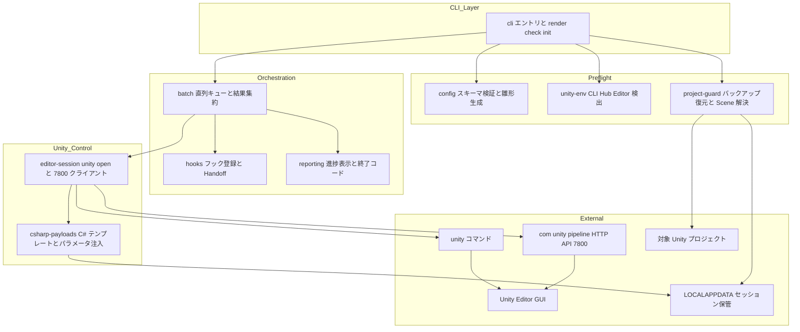
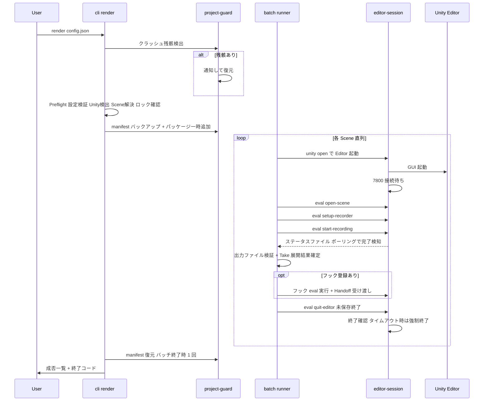
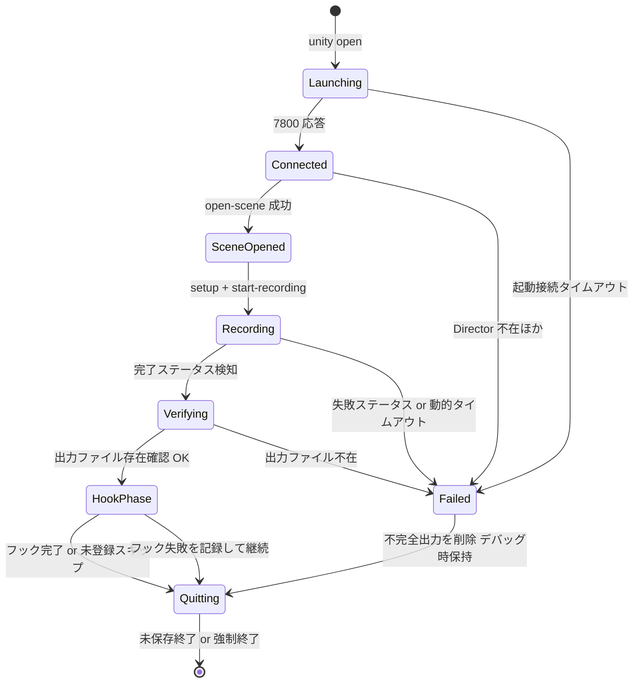
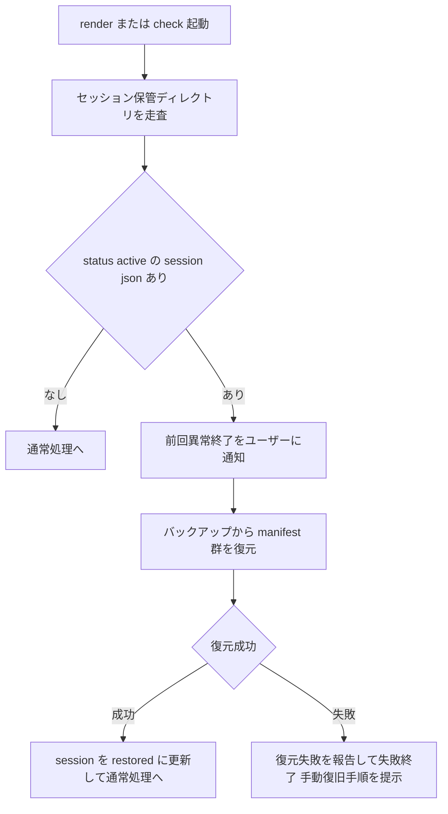

# Technical Design Document: unity-render-core

## Overview

**Purpose**: unity-render-core は、Unity プロジェクトの外部から Scene 名を指定し、公式 Unity CLI（`unity open` / `unity command eval`、`com.unity.pipeline` の HTTP API）で Unity Editor を GUI モードで駆動し、Unity Recorder による映像書き出しをバッチ実行する TypeScript 製 Windows CLI ツールを提供する。プロジェクトへの C# スクリプト注入を行わず、実行後にプロジェクトへ恒久的変更を残さない（`git status` クリーン）ことを最重要の設計原則とする。

**Users**: Unity プロジェクトの映像書き出しを自動化したい開発者・映像制作者が、設定 JSON を書いて `render` コマンドを 1 回実行するワークフローで利用する。CI からの利用も終了コードで成否判定できる形で想定する。

**Impact**: 本リポジトリは greenfield（`package.json` に `@hidano/artgraph` の devDependency のみ、`src/` なし）であり、本設計は CLI 本体の全レイヤと開発基盤（tsconfig / lint / test / ビルド / CI）の新規構築を定義する。

### Goals

- Scene 名指定のみで複数 Scene の映像書き出し（MP4 + MOV(ProRes)）を直列バッチ実行できる
- プロジェクト非介入の原則を異常系（クラッシュ・タイムアウト・強制終了）まで含めて保証する
- `bun build --compile` による単一 .exe 配布で、Node/Bun 未インストール環境でも動作する
- timeline-audio-remux（Spec 2）が利用するフック地点と受け渡し型を安定した契約として提供する
- 検証スパイク（Requirement 1）で experimental 基盤の成立性を最初に確認し、本設計の暫定決定を実測で確定する（スパイクは render 本体実装の必須ゲートであり、通過まで後続実装に着手しない。「Research Needed / スパイク依存の暫定決定」節参照）

### Non-Goals

- 音声の抽出・合成一切（timeline-audio-remux の責務。本 Spec の出力映像は無音）
- Web UI / ローカルサーバ、macOS / Linux 対応、プリセット管理・設定 GUI
- Unity 6.0 未満のプロジェクト対応、Unity アカウント認証フローの自動化（ドキュメント化のみ）
- WebM・連番（PNG/EXR）出力（D-2 により初期スコープ外）
- 複数 Scene の並列実行（S1-3 により直列のみ）

## Boundary Commitments

### This Spec Owns

- JSON 設定ファイルのスキーマ定義・読み込み・検証（`render` / `check` / `init` サブコマンド体系を含む）
- Unity CLI / Unity Hub / Unity Editor の検出・バージョン一致確認・`unity install` 誘導
- `manifest.json` / `packages-lock.json` のバックアップ・一時パッケージ追加・復元・クラッシュ復旧（バックアップメタデータの保管場所と形式を含む）
- Editor の GUI 起動、localhost:7800 接続、eval 実行、未保存終了・強制終了のライフサイクル管理
- eval 経由で Editor 内に送り込む C# ペイロード一式（Scene オープン、PlayableDirector 検出、メモリ上 Recorder 構成、書き出し実行・完了検知、未保存終了）
- 直列バッチキュー、進捗表示、終了コード、タイムアウト管理、失敗時出力の自動削除
- フック地点の定義と `RenderHandoff` 型（映像パス・実効フレームレート・イン/アウト点）の契約

### Out of Boundary

- 音声メタデータ JSON スキーマの定義とフックで実行する音声抽出用 C#（timeline-audio-remux の責務）
- ffmpeg の同梱・実行（timeline-audio-remux の責務）
- 出力映像の後加工・アップロード等の下流ワークフロー
- Unity 側パッケージ（com.unity.pipeline / com.unity.recorder）自体の不具合修正・フォーク

### Allowed Dependencies

- 公式 Unity CLI（`unity` コマンド）と `com.unity.pipeline` の HTTP API（localhost:7800）— 唯一の Editor 制御経路
- Unity Recorder（`com.unity.recorder`）— 対象プロジェクトへの一時追加パッケージとして
- Windows ファイルシステム（`%LOCALAPPDATA%` のツール専有ディレクトリ）— バックアップ・セッション状態の保管
- pnpm（依存管理）+ Bun（ビルド・実行ツールチェーン）+ vitest（テスト）
- 対象 Unity プロジェクトへの依存は「読み取り + manifest 2 ファイルの一時書き換え」のみに制限する。それ以外の書き込み（Assets/、ProjectSettings/ への保存）は禁止

### Revalidation Triggers

- `RenderHandoff` 型・フック API のシェイプ変更（→ timeline-audio-remux の再検証必須）
- 設定 JSON スキーマの破壊的変更
- `com.unity.pipeline` の API 変更（experimental のため恒常的リスク。CLI バージョン検出で緩和）
- バックアップメタデータ形式（`session.json`）の変更（クラッシュ復旧の後方互換に影響）
- 出力フォーマット構成（同時 2 形式収録 → 逐次収録への変更等。Spec 2 の mux 対象が変わる）

## Architecture

### Architecture Pattern & Boundary Map

レイヤードアーキテクチャを採用する。下位レイヤ（左）から上位レイヤ（右）への一方向依存のみを許可する。

**依存方向（違反はレビューエラーとする）**:

```
shared → config → { unity-env, project-guard, csharp-payloads } → editor-session → batch → cli
                                              reporting / hooks ↗（shared のみに依存し batch から利用される）
```



**Architecture Integration**:

- 選択パターン: レイヤード + 明示的な合成ルート（`cli` がすべてのサービスを組み立てる）。greenfield のため既存パターン制約なし
- ドメイン境界: 「Editor を起動しない事前検証（Preflight）」と「Editor を起動する実行（Unity_Control / Orchestration）」を厳密に分離する。`check` サブコマンドは Preflight レイヤのみで完結する
- `project-guard` はファイルシステム操作のみで完結する最も単体テスト容易なレイヤであり、非介入原則の中核を担う
- `csharp-payloads` は C# コードを**別ファイルのテンプレート**として管理し、TypeScript 側はパラメータ注入と送信のみを担う（C# を TS 文字列リテラルに埋め込まない）
- Steering 準拠: `.kiro/steering/` には artgraph 規約のみ存在するため、トレーサビリティ規約（後述）以外の既存アーキテクチャ制約はない

### Technology Stack

| Layer | Choice / Version | Role in Feature | Notes |
|-------|------------------|-----------------|-------|
| 言語 / ランタイム | TypeScript 5.x (strict) / Bun 1.2+ | CLI 本体の実装・実行 | `bun build --compile --target=bun-windows-x64` で単一 .exe 生成（D-3） |
| 依存管理 | pnpm | パッケージ管理 | リポジトリは既に pnpm 管理（`@hidano/artgraph`）。Bun はビルド・実行ツールチェーンに限定し、依存解決は pnpm に統一する |
| CLI フレームワーク | commander 12+ | サブコマンド解析（`render` / `check` / `init`） | 成熟・軽量・bun compile 互換 |
| スキーマ検証 | zod 4.x | 設定 JSON の型検証と項目特定可能なエラー生成 | 2.4（項目特定エラー）の実現手段 |
| テスト | vitest 3.x + @hidano/artgraph/vitest | 単体・結合テスト、trace shard 生成 | AGENTS.md 記載の artgraph trace runner と統合するため bun test ではなく vitest を採用。テストは Node 上で実行 |
| Lint / Format | Biome | 静的検査・整形 | 単一ツールで完結、CI 高速化 |
| 外部プロセス | 公式 Unity CLI（`unity`）+ com.unity.pipeline (beta) | Editor 起動・eval 実行 | experimental。破壊的変更リスクをドキュメント明記（1.4） |
| Unity 側 | Unity 6.0+ / com.unity.recorder | 映像書き出し | 対象プロジェクトへ一時追加（G-3） |
| CI | GitHub Actions (windows-latest) | typecheck / lint / vitest / artgraph gate | 既存 CI は gitleaks のみ。Windows 専用ツールのため Windows ランナーでパス処理まで検証 |

## File Structure Plan

### Directory Structure

```
src/
├── cli/                      # 合成ルートとサブコマンド
│   ├── index.ts              # エントリポイント（commander 定義、終了コード変換）
│   ├── render.ts             # render サブコマンド（Preflight → Guard → Batch）
│   ├── check.ts              # check サブコマンド（Preflight のみ）
│   └── init.ts               # init サブコマンド（雛形 JSON 生成）
├── shared/
│   ├── types.ts              # Result 型、共通エラー分類、JsonValue
│   ├── logger.ts             # 通常/デバッグの 2 モードロガー
│   └── paths.ts              # ツール専有ディレクトリ（%LOCALAPPDATA%）の解決
├── config/
│   ├── schema.ts             # zod スキーマと RenderConfig 型
│   ├── load.ts               # 読み込み・検証・既定値適用・タイムアウト算出
│   └── template.ts           # init 用の雛形 JSON
├── unity-env/
│   ├── unity-cli.ts          # unity コマンドの検出・実行可否確認・バージョン取得
│   ├── editors.ts            # インストール済み Editor 列挙（unity editors -i）
│   ├── project-version.ts    # ProjectVersion.txt 解析と 6.0+ 判定
│   └── install.ts            # unity install の対話確認と実行（非対話時は中断）
├── project-guard/
│   ├── backup.ts             # manifest/packages-lock のバックアップと復元
│   ├── manifest-patch.ts     # com.unity.recorder / com.unity.pipeline の一時追加
│   ├── recovery.ts           # 起動時のバックアップ残骸検出と復旧
│   ├── lock.ts               # プロジェクトロック競合検出（Temp/UnityLockfile）
│   └── scene-resolver.ts     # Scene 名 → .unity パス解決（重複・不足検出）
├── editor-session/
│   ├── session.ts            # unity open 起動、7800 接続待ち、終了・強制終了
│   ├── pipeline-client.ts    # HTTP クライアント（eval / eval_file 送信）
│   └── status-channel.ts     # ステータスファイル経由の完了検知ポーリング
├── csharp-payloads/
│   ├── compile.ts            # テンプレート読み込みとパラメータ注入（JSON エスケープ）
│   └── templates/            # eval に送る C# テンプレート（ビルド時に .exe へ埋め込み）
│       ├── open-scene.cs         # Scene オープン + PlayableDirector 検出
│       ├── setup-recorder.cs     # メモリ上 Recorder 構成 + フレームレート上書き
│       ├── start-recording.cs    # Play Mode 突入 + 書き出し開始 + ステータス書き出し
│       └── quit-editor.cs        # 未保存終了（EditorApplication.Exit）
├── batch/
│   ├── runner.ts             # 直列キュー、Scene ごとの Editor 再起動、結果集約
│   ├── scene-job.ts          # 1 Scene のジョブフロー（起動→構成→書き出し→フック→終了）
│   └── output.ts             # ワイルドカード展開、<Take> 採番、出力検証、失敗時削除
├── reporting/
│   ├── progress.ts           # 進捗表示（OSC 8 エクスプローラーリンク含む）
│   └── exit-code.ts          # BatchResult → 終了コード変換
└── hooks/
    └── registry.ts           # RenderHooks 登録 API と RenderHandoff 型
tests/                        # vitest（src/ とミラー構成）
docs/
└── setup.md                  # 初回セットアップ（unity auth login、experimental リスク明記）
spike/
└── README.md                 # 検証スパイクの実装ゲート文書（Requirement 1。1.2 の全検証項目・成功基準・失敗基準・実測ログ・ユーザー承認状態を記録）
```

### Modified Files

- `package.json` — scripts（build / test / lint / typecheck）、依存追加（commander, zod, vitest, biome ほか）
- `.gitignore` — `dist/`、`*.exe`、vitest / artgraph trace の生成物を追加
- 新規: `tsconfig.json`（strict, `noUncheckedIndexedAccess`）、`biome.json`、`vitest.config.ts`（artgraph trace runner 組込み）、`.github/workflows/ci.yml`

> スキャフォールディング（tsconfig / lint / CI / .gitignore）は tasks フェーズで検証スパイクの直後の初期タスク群とする。ただし render 本体の実装タスクおよび P-1〜P-13 の暫定実装の採用は、検証スパイクの実装ゲート（「Research Needed / スパイク依存の暫定決定」節）を通過するまで開始しない。

## System Flows

> **前提（実装ゲート）**: 本節のフローおよび暫定決定 P-1〜P-13 に依存する実装は、検証スパイク（Requirement 1）の実装ゲート（「Research Needed / スパイク依存の暫定決定」節）を通過するまで開始してはならない。`spike/README.md` に 1.2 の全検証項目・成功基準・失敗基準・実測ログ・ユーザー承認状態を記録し、1.3 の不成立に該当しないことを確認してから着手する。不成立時は NO-GO とし、代替方式の再要件化を行う。

### render コマンド全体シーケンス



**フロー上の決定事項**:

- バックアップ・パッケージ一時追加はバッチ開始時に 1 回、復元はバッチ終了時に 1 回。Scene ごとの Editor 再起動（D-1 / 12.4）の間は一時追加状態を維持する（6.3）
- Scene 処理中のあらゆる失敗（接続不能・Director 不在・書き出し失敗・タイムアウト・フック失敗）は「当該 Scene の失敗記録 + Editor プロセスの確実な終了 + 次 Scene へ継続」に収束させる（10.5 / 11.2 / 12.2 / 14.4）。バッチ終了時の復元は `finally` 相当で必ず実行する
- 完了検知はステータスファイル方式を**候補**とする（後述の暫定決定 P-2。スパイク成功まで採用未確定）

### 1 Scene ジョブの状態遷移



### クラッシュ復旧フロー



## Requirements Traceability

| Requirement | Summary | Components | Interfaces | Flows |
|-------------|---------|------------|------------|-------|
| 1.1–1.4 | 検証スパイク | spike/（タスク先行）、docs/setup.md | — | — |
| 2.1–2.5 | JSON 設定ファイル | config | `RenderConfig`, `loadConfig` | render シーケンス Preflight |
| 3.1–3.2 | 出力ファイル名ワイルドカード | batch/output | `expandWildcards` | 1 Scene ジョブ Verifying |
| 4.1–4.9 | Unity 検出とバージョン一致 | unity-env | `UnityEnvService` | render シーケンス Preflight |
| 5.1–5.4 | Scene 存在チェック | project-guard/scene-resolver | `resolveScenes` | render シーケンス Preflight |
| 6.1–6.6 | バックアップ・原状復帰・クラッシュ復旧 | project-guard | `ProjectGuardService`, `BackupSession` | クラッシュ復旧フロー |
| 7.1–7.5 | Editor GUI 起動と接続 | editor-session | `EditorSession` | 1 Scene ジョブ Launching |
| 8.1–8.4 | Scene オープンと Director 検出 | csharp-payloads/open-scene | `OpenSceneResult` | 1 Scene ジョブ SceneOpened |
| 9.1–9.6 | メモリ上 Recorder 構成 | csharp-payloads/setup-recorder | `RecorderSetupParams` | 1 Scene ジョブ Recording |
| 10.1–10.7 | 書き出し実行と完了検知 | editor-session/status-channel, batch/output | `RecordingStatus` | 1 Scene ジョブ Recording→Verifying |
| 11.1–11.2 | Editor 未保存終了 | csharp-payloads/quit-editor, editor-session | `requestQuit`, `kill` | 1 Scene ジョブ Quitting |
| 12.1–12.4 | 直列バッチ実行 | batch/runner | `BatchRunner`, `BatchResult` | render シーケンス loop |
| 13.1–13.5 | 進捗表示・デバッグ・終了コード | reporting, shared/logger | `ProgressReporter`, `toExitCode` | render シーケンス末尾 |
| 14.1–14.4 | Spec 2 向けフック | hooks | `RenderHooks`, `RenderHandoff` | 1 Scene ジョブ HookPhase |
| 15.1–15.4 | CLI コマンド体系と配布 | cli | commander 定義, build script | — |

## Components and Interfaces

| Component | Domain/Layer | Intent | Req Coverage | Key Dependencies (P0/P1) | Contracts |
|-----------|--------------|--------|--------------|--------------------------|-----------|
| config | Preflight | 設定 JSON の検証・既定値・タイムアウト算出 | 2, 10.6, 15.3 | zod (P0) | Service |
| unity-env | Preflight | Unity CLI/Hub/Editor 検出とバージョン一致 | 4 | unity CLI (P0) | Service |
| project-guard | Preflight | バックアップ・復元・復旧・ロック・Scene 解決 | 5, 6, 7.5 | shared/paths (P0) | Service, State |
| editor-session | Unity Control | Editor 起動・7800 接続・eval・終了 | 7, 10.2, 11 | unity CLI (P0), com.unity.pipeline (P0) | Service |
| csharp-payloads | Unity Control | C# テンプレート管理とパラメータ注入 | 8, 9, 11.1 | — | Service |
| batch | Orchestration | 直列キュー・Scene ジョブ・出力管理 | 3, 10, 12 | editor-session (P0), hooks (P1) | Service, Batch |
| reporting | Orchestration | 進捗表示・終了コード | 13 | — | Service |
| hooks | Orchestration | Spec 2 拡張点と Handoff 契約 | 14 | editor-session 型 (P1) | Service, Event |
| cli | CLI | 合成ルートとサブコマンド | 15 | 全レイヤ (P0) | — |

共通基盤型（`shared/types.ts`）:

```typescript
type Result<T, E> = { ok: true; value: T } | { ok: false; error: E };
type JsonValue = string | number | boolean | null | JsonValue[] | { [key: string]: JsonValue };
```

### Preflight レイヤ

#### config

| Field | Detail |
|-------|--------|
| Intent | 設定 JSON の読み込み・検証・既定値適用・動的タイムアウト算出 |
| Requirements | 2.1, 2.2, 2.3, 2.4, 2.5, 10.6, 15.3 |

**Responsibilities & Constraints**

- zod スキーマで必須項目欠落・型不正・不正値を Editor 起動前に検出し、項目パス付きエラーを返す（2.4）
- イン/アウト点未指定時は「Timeline 全長」を示す `range: undefined` を保持する（全長の実値は Editor 内でしか判明しないため、C# ペイロード側で解決する。2.2）
- プリセット管理は提供しない。読み込み専用のミニマム構成（2.5）

**Contracts**: Service [x]

##### Service Interface

```typescript
type OutputFormat = "mp4" | "mov-prores";

interface RenderConfig {
  readonly projectPath: string;              // 絶対 or 相対（CWD 基準で絶対化）
  readonly scenes: readonly string[];        // Scene 名（パス不可） 1 件以上
  readonly range?: { readonly inPoint: number; readonly outPoint: number }; // 秒 未指定は Timeline 全長
  readonly resolution: { readonly width: number; readonly height: number };
  readonly frameRate: number;                // fps 正数
  readonly formats: readonly OutputFormat[]; // 1〜2 件 重複不可
  readonly output: {
    readonly directory: string;
    readonly fileName: string;               // Recorder ワイルドカード可 拡張子なし
  };
  readonly debug?: boolean;                  // 既定 false
  readonly timeouts?: {
    readonly recordingSec?: number;          // 未指定は動的算出
    readonly editorStartSec?: number;        // 既定 600
    readonly editorQuitSec?: number;         // 既定 60
  };
}

interface ConfigError {
  readonly kind: "not-found" | "parse-error" | "validation-error";
  readonly issues: readonly { readonly path: string; readonly message: string }[];
}

interface ConfigService {
  loadConfig(filePath: string): Promise<Result<RenderConfig, ConfigError>>;
  resolveRecordingTimeoutSec(config: RenderConfig, recordDurationSec: number): number;
  generateTemplate(): string; // init 用の雛形 JSON 文字列
}
```

- Preconditions: なし（最初に呼ばれる）
- Postconditions: 成功時の `RenderConfig` は全項目が型・値域検証済み。`inPoint < outPoint`、`formats` 非空を保証
- Invariants: 検証エラー時に Unity 関連処理を一切開始しない

**Implementation Notes**

- 動的タイムアウト算出式（D-5 / 10.6 の確定値。スパイク実測で係数調整）: `recordingTimeoutSec = ceil(recordDurationSec × 3) + 180`。係数 3 は AsyncGPUReadback 同期化（約 1.5 倍）+ ProRes エンコード + Play Mode 突入オーバーヘッドを包含し、固定マージン 180 秒はドメインリロードを吸収する。`recordDurationSec` はイン/アウト指定時はその差、未指定時は Editor 内で取得した Timeline 全長を用いて Scene ごとに算出する
- Risks: Timeline 全長が Editor 起動後にしか判明しないため、range 未指定時のタイムアウト確定は `open-scene` ペイロードの応答後になる（設計上許容）

#### unity-env

| Field | Detail |
|-------|--------|
| Intent | 公式 Unity CLI・インストール済み Editor の検出とプロジェクト要求バージョンの一致確認 |
| Requirements | 4.1, 4.2, 4.3, 4.4, 4.5, 4.6, 4.7, 4.8, 4.9 |

**Responsibilities & Constraints**

- `unity` コマンドの存在・実行可否を最初に確認し、不在時はセットアップドキュメント参照を含むエラーで失敗終了（4.7, 4.8）
- `unity editors -i` の出力からインストール済み Editor を列挙する（Unity Hub のインストール情報は Unity CLI が集約するため、レジストリ/Hub 設定ファイルの直接読取は行わない）
- `ProjectSettings/ProjectVersion.txt` の `m_EditorVersion` を解析し、`6000.` 未満（Unity 6.0 未満）は非対応エラー（4.6）
- 不一致時は対話確認（`unity install <version>` 実行 or 中断）。`ensureEditor` の `interactive` は **`stdin.isTTY === true` かつ CLI が明示的な対話モードで動作している場合のみ true** とする。`interactive === false` の場合、バージョン不一致時は `unity install` を実行せず即座に `install-declined` を返し、対象プロジェクトへ一切変更を加えない（4.5, 4.9）

**Contracts**: Service [x]

##### Service Interface

```typescript
interface UnityVersion { readonly raw: string; readonly major: number; } // 例 raw: "6000.1.5f1"
interface EditorInstall { readonly version: UnityVersion; readonly executablePath: string; }

interface EnvError {
  readonly kind: "cli-not-found" | "cli-exec-failed" | "unsupported-unity-version"
    | "editor-not-found" | "install-declined" | "install-failed" | "project-version-unreadable";
  readonly message: string;
}

interface UnityEnvService {
  detectUnityCli(): Promise<Result<{ readonly cliVersion: string }, EnvError>>;
  listEditors(): Promise<Result<readonly EditorInstall[], EnvError>>;
  readProjectVersion(projectPath: string): Promise<Result<UnityVersion, EnvError>>;
  /**
   * 一致 Editor を返す。不一致時は install 確認フロー。
   * interactive は stdin.isTTY === true かつ明示的な対話モードでのみ true。
   * interactive === false のとき不一致なら install-declined を返し、
   * unity install は実行しない（プロジェクト非変更）。
   */
  ensureEditor(required: UnityVersion, interactive: boolean): Promise<Result<EditorInstall, EnvError>>;
}
```

- Preconditions: `readProjectVersion` は `projectPath` がディレクトリとして存在すること
- Postconditions: `ensureEditor` 成功時、要求バージョンと完全一致する Editor が利用可能
- Invariants: 本コンポーネントは対象プロジェクトへ一切書き込まない

**Implementation Notes**

- `unity editors -i` の出力フォーマットは公式ドキュメントに機械可読形式の保証がない。パーサは行単位の寛容な解析とし、解析失敗時は `cli-exec-failed` でデバッグモードに生出力を表示する
- Risks: Unity CLI が experimental のため出力形式変更リスクあり。パーサを 1 ファイルに隔離しテストで固定する

#### project-guard

| Field | Detail |
|-------|--------|
| Intent | プロジェクト非介入原則の実装: バックアップ・一時追加・復元・クラッシュ復旧・ロック競合検出・Scene 解決 |
| Requirements | 5.1, 5.2, 5.3, 5.4, 6.1, 6.2, 6.3, 6.4, 6.5, 6.6, 7.5 |

**Responsibilities & Constraints**

- バックアップとセッション状態は**対象プロジェクト外**のツール専有ディレクトリに保管し、プロジェクトを汚染しない（G-3）:
  `%LOCALAPPDATA%\unity-render-core\sessions\<projectHash>-<timestamp>\`（`projectHash` = プロジェクト絶対パスの SHA-256 先頭 12 hex）。配下に `session.json`（メタデータ）+ `manifest.json` / `packages-lock.json` のコピー
- バックアップ保存 → 検証（コピーのバイト一致確認）→ 成功後にのみ manifest へ一時追加（6.6 fail-fast）
- 一時追加: `com.unity.recorder` は manifest に未記載の場合のみ追加、`com.unity.pipeline` は常に追加（既に導入済みなら追加不要と判定）。バージョンはスパイクで動作確認した固定バージョンをピン止めする
- 復元は「バックアップコピーの上書き書き戻し + `session.json` を `restored` に更新」。復元完了後にセッションディレクトリを削除する（クリーンアップ）
- クラッシュ復旧: `render` / `check` の起動時に `sessions\` を走査し、`status: "active"` が残っていれば通知のうえ復元を実行する（6.4）。`check` でも復旧は実行する（ユーザーの原状回復が最優先のため。`check` の「プロジェクト無変更」原則の唯一の例外として明記）
- ロック競合検出（7.5）: `<project>\Temp\UnityLockfile` を排他モードでオープン試行する。オープン失敗（共有違反）= 別 Editor が使用中 → 競合エラー。ファイル不在または排他オープン成功（クラッシュ残骸）= 続行可。存在チェックのみでは stale lockfile を誤検知するため排他オープン方式を採用する
- Scene 解決（5.1–5.4）: `<project>\Assets\**\*.unity` を走査し、拡張子を除いたファイル名と Scene 名を大文字小文字区別で照合する。`Packages/` 内の Scene は対象外。0 件 → 不足一覧を提示して即エラー、2 件以上 → 候補パス一覧を提示して即エラー

**Contracts**: Service [x] / State [x]

##### Service Interface

```typescript
interface BackupSession {
  readonly version: 1;
  readonly projectPath: string;
  readonly createdAt: string;               // ISO 8601 UTC
  readonly status: "active" | "restored";
  readonly files: readonly {
    readonly relativePath: string;          // 例 "Packages/manifest.json"
    readonly backupFileName: string;
    readonly sha256: string;
  }[];
  readonly addedPackages: readonly { readonly name: string; readonly version: string }[];
}

interface GuardError {
  readonly kind: "backup-failed" | "restore-failed" | "manifest-patch-failed" | "io-error";
  readonly message: string;
  readonly manualRecoveryHint?: string;     // 復元失敗時の手動復旧手順
}
interface LockConflictError { readonly kind: "project-locked"; readonly lockfilePath: string; }
interface SceneResolutionError {
  readonly kind: "scenes-missing" | "scenes-ambiguous";
  readonly details: readonly { readonly sceneName: string; readonly candidatePaths: readonly string[] }[];
}
interface ResolvedScene { readonly sceneName: string; readonly assetPath: string; } // Assets/ 相対

interface ProjectGuardService {
  detectStaleSessions(): Promise<readonly BackupSession[]>;
  restoreSession(session: BackupSession): Promise<Result<void, GuardError>>;
  beginSession(projectPath: string): Promise<Result<BackupSession, GuardError>>; // バックアップ + 一時追加
  endSession(session: BackupSession): Promise<Result<void, GuardError>>;         // 復元 + クリーンアップ
  checkProjectLock(projectPath: string): Promise<Result<void, LockConflictError>>;
  resolveScenes(projectPath: string, names: readonly string[]): Promise<Result<readonly ResolvedScene[], SceneResolutionError>>;
}
```

- Preconditions: `beginSession` はロック競合チェック通過後に呼ぶ
- Postconditions: `endSession` 成功後、manifest 2 ファイルはバックアップとバイト一致（`git status` クリーン。6.5）
- Invariants: `session.json` の `status: "active"` は「復元未完了」と等価。プロセスがどこで死んでもこの不変条件で復旧可能

##### State Management

- State model: `session.json`（上記 `BackupSession`）が唯一の永続状態。書き込みは atomic rename（temp file → rename）で行い、部分書き込みを防ぐ
- Persistence & consistency: セッションディレクトリ単位で自己完結。復元成功後に削除
- Concurrency strategy: 同一プロジェクトに対する多重実行は、`active` セッション既存時に「実行中または未復旧」としてエラー停止する（多重起動ガードを兼ねる）

**Implementation Notes**

- 本コンポーネントは Unity プロセスに依存せず、全機能が一時ディレクトリのみで単体テスト可能。テストカバレッジの最重点対象
- Risks: `packages-lock.json` が存在しないプロジェクト（初回 import 前）があり得る。不在時は「不在」を `session.json` に記録し、復元時に「削除」で原状回復する

### Unity Control レイヤ

#### editor-session

| Field | Detail |
|-------|--------|
| Intent | 1 Editor プロセスのライフサイクル管理（起動・接続・eval・終了・強制終了）と完了検知チャネル |
| Requirements | 7.1, 7.2, 7.3, 10.2, 10.5, 11.1, 11.2 |

**Responsibilities & Constraints**

- `unity open <projectPath>` で Editor を GUI モードで起動する（`-batchmode` / `-nographics` 不使用。7.1）。起動した Editor プロセスの PID を追跡し、強制終了（`taskkill /PID <pid> /T /F`）を常に可能にする
- 起動後、`http://localhost:7800` へ 2 秒間隔でヘルスチェックを行い、`editorStartSec`（既定 600 秒。パッケージ import・コンパイルを含む）以内に応答がなければプロセスを強制終了して失敗扱い（7.3）
- eval 送信はコマンドライン長・エスケープ制約を回避するため、ペイロードをセッション一時ファイルに atomic write し `eval_file` で送信する `file` トランスポートを既定採用する（P-1）。短い処理のみ inline を許可し、応答受領後（失敗時は finally）に一時ファイルを削除する
- 完了検知は `status-channel`（C# ペイロードが書き込むステータス JSON ファイルを CLI 側がポーリング）を採用する（P-2 条件付き成立）。JSON は temp→rename の atomic write とし、実装時に Play Mode・ドメインリロード・強制終了の再検証を行う。以下を `RecordingStatus` / `EditorSession` の契約とする:
  - ステータス JSON の atomic write 仕様（C# 側の temp file → rename 可否、部分書き込みの発生条件と CLI 側スキップ規則）
  - 状態遷移（`preparing → recording → completed | failed` の許容遷移と、過去実行の古い status ファイルの識別方法）
  - ステータスが更新不能になった場合のタイムアウト（`recording` のまま `elapsedSec` が進行しない場合の打ち切り条件）
  - ドメインリロード後の監視コールバック・Recorder 構成の再適用条件。**P-7 が不成立（in-memory Recorder 構成がドメインリロードで失われる）と判明した場合は、Play Mode 突入後の `setup-recorder` 再適用（2 段ペイロード構成）を必須とする**
- `requestQuit` は `quit-editor.cs`（`EditorApplication.Exit(0)`、保存ダイアログを経由しない）を送信し、`editorQuitSec`（既定 60 秒）以内にプロセス終了しなければ強制終了する（11.2）

**Contracts**: Service [x]

##### Service Interface

```typescript
interface SessionError {
  readonly kind: "launch-failed" | "connect-timeout" | "port-conflict"
    | "eval-failed" | "eval-timeout" | "eval-transport-failed" | "quit-timeout";
  readonly message: string;
  readonly unityLogExcerpt?: string;        // デバッグモード時のみ収集
}

type EvalResult = Result<{ readonly returnValue: string }, SessionError>;

/** eval 送信方式（判別可能ユニオン）。既定は file（P-1 第一候補） */
type EvalTransport =
  | { readonly kind: "file" }          // 一時ファイル + eval_file 送信（P-1 第一候補）
  | { readonly kind: "inline" }        // 短小ペイロードの本文直接送信
  | { readonly kind: "inline-split" }; // P-1 不成立時: クラス定義の事前送信 + 呼び出しの分割送信

interface EvalOptions {
  readonly timeoutSec: number;
  readonly transport: EvalTransport;
}

interface EditorSession {
  readonly state: "starting" | "connected" | "terminated";
  start(editor: EditorInstall, projectPath: string, timeoutSec: number): Promise<Result<void, SessionError>>;
  eval(payload: CompiledPayload, options: EvalOptions): Promise<EvalResult>;
  requestQuit(timeoutSec: number): Promise<void>;   // 失敗時は内部で kill にフォールバック
  kill(): Promise<void>;                            // 冪等
}

type RecordingStatus =
  | { readonly state: "preparing" }
  | { readonly state: "recording"; readonly elapsedSec: number }
  | { readonly state: "completed"; readonly timelineDurationSec: number }
  | { readonly state: "failed"; readonly reason: string };

interface StatusChannel {
  readonly statusFilePath: string;          // C# ペイロードへ注入するパス
  poll(intervalMs: number, timeoutSec: number): Promise<Result<RecordingStatus, SessionError>>;
}
```

- Preconditions: `eval` は `state === "connected"` のときのみ呼び出し可能
- Postconditions: `requestQuit` / `kill` 完了後、Editor プロセスは存在しない（`state === "terminated"`）
- Invariants: 1 インスタンス = 1 Editor プロセス。Scene ごとに新規インスタンスを生成する（D-1）

**pipeline-client の eval トランスポート契約**:

- `file`（P-1 採用）: セッション一時ディレクトリへ `payload-<id>-<連番>.cs` を atomic write（temp → rename）→ `eval_file` リクエスト（`file` + 任意 `timeout`）を送信 → 応答受領後に一時ファイルを削除する（失敗経路でも finally で削除。デバッグモード時のみ保持）
- 再試行: 接続レベルの失敗（接続拒否・ソケットタイムアウト）のみ 2 秒間隔で最大 3 回再試行する。eval が受理され C# 実行段階で失敗したものは再試行しない（副作用の二重実行防止）。再試行を使い切った送信失敗は `eval-transport-failed`、C# 実行失敗は `eval-failed` に分類する
- ログ: デバッグモード時にペイロード ID・サイズ・トランスポート種別・HTTP ステータス・応答本文を時系列で出力する（13.2）
- `inline-split`（P-1 不成立時のフォールバック）: `compile.ts` がテンプレートを「クラス定義ペイロード + 呼び出しペイロード」に分割し、pipeline-client は同一契約（再試行・ログ・エラー分類）で順次 inline 送信する。分割は `csharp-payloads` / `pipeline-client` 内に閉じ、上位層の呼び出しシグネチャ（`eval(payload, options)`）は不変

**Implementation Notes**

- Integration: com.unity.pipeline の HTTP API 仕様（エンドポイントパス・リクエスト形式・`eval_file` の受け付け形態）は公式ドキュメントに詳細記載がなく、スパイクで確定する。`pipeline-client.ts` に API 依存を隔離する
- Validation: 接続確立・eval 応答・終了の各段階でデバッグモード時に Unity Editor ログ（`%LOCALAPPDATA%\Unity\Editor\Editor.log`）の末尾を収集してエラーに添付する（7.3 / 13.2）
- ポート 7800 は**固定値として確定**する（設定項目 `pipelinePort` は追加しない）。起動前にポート使用チェックを行い、使用中であれば Editor を起動せず即時に `port-conflict` エラーで失敗する（メッセージで「7800 番ポートを使用するプロセス（既存 Editor を含む）の終了」を案内する）。スパイク P-5 でポートの構成可能性は確認するが、構成可能と判明しても初期リリースでは固定運用とする
- Risks: `com.unity.pipeline` は experimental であり、API 変更時は `pipeline-client` の隔離範囲で再検証する

#### csharp-payloads

| Field | Detail |
|-------|--------|
| Intent | eval で実行する C# テンプレートの管理と型安全なパラメータ注入 |
| Requirements | 8.1, 8.2, 8.3, 8.4, 9.1, 9.2, 9.3, 9.4, 9.5, 9.6, 10.1, 11.1 |

**Responsibilities & Constraints**

- C# コードは `templates/*.cs` の独立ファイルとして管理し、ビルド時に文字列アセットとして .exe へ埋め込む（`import ... with { type: "text" }`）。TS 文字列リテラルへの直接埋め込みは禁止（可読性・レビュー容易性のため）
- パラメータ注入はプレースホルダ（`/*__PARAMS_JSON__*/`）へ JSON 文字列を埋め込む単一方式に統一し、C# 側で JSON をデシリアライズする。文字列連結による C# コード組み立ては行わない（エスケープ事故防止）
- 各テンプレートの責務:
  - `open-scene.cs`: `EditorSceneManager.OpenScene`（保存確認なしモード）→ ルート階層 GameObject から PlayableDirector を列挙。複数なら警告情報付きで先頭を選択（8.3）、0 件ならエラー応答（8.4）。TimelineAsset の全長・実効フレームレートを応答に含める（range 未指定時の全長解決とタイムアウト算出に使用）
  - `setup-recorder.cs`: 対象 TimelineAsset に RecorderTrack を追加し、要求フォーマットごとに RecorderClip + MovieRecorderSettings を**メモリ上のみ**で構築（`hideFlags = DontSave`、`AssetDatabase` 登録なし。9.1）。解像度・出力パス（TS 側でワイルドカード展開済みの確定パス）を適用（9.2）、Timeline 実効フレームレートを設定値で上書き（9.3）、イン/アウト点を RecorderClip の記録範囲に設定（9.4）、AsyncGPUReadback 同期化を有効化（9.5。注入方法はスパイク項目）
  - `start-recording.cs`: Play Mode 突入 + PlayableDirector 再生開始。書き出し進行・完了・失敗をステータス JSON ファイルへ逐次書き込む監視コールバックを登録（10.1, 10.2）
  - `quit-editor.cs`: シーン・アセットを保存せず `EditorApplication.Exit(0)`（11.1）
- 音声は Recorder で収録しない（MovieRecorderSettings の audio capture 無効。9.6）

**Contracts**: Service [x]

##### Service Interface

```typescript
type PayloadId = "open-scene" | "setup-recorder" | "start-recording" | "quit-editor";

interface CompiledPayload {
  readonly id: PayloadId;
  readonly source: string;                  // パラメータ注入済み C#
}

interface OpenSceneResult {
  readonly directorFound: boolean;
  readonly multipleDirectorsWarning: boolean;
  readonly directorName: string | null;
  readonly timelineDurationSec: number | null;
  readonly timelineFrameRate: number | null;
}

interface RecorderSetupParams {
  readonly outputs: readonly { readonly format: OutputFormat; readonly absolutePath: string }[];
  readonly width: number;
  readonly height: number;
  readonly frameRate: number;
  readonly inPoint: number;                 // 秒 range 未指定時は 0
  readonly outPoint: number;                // 秒 range 未指定時は Timeline 全長
  readonly statusFilePath: string;
}

interface PayloadCompiler {
  compile(id: PayloadId, params: Record<string, JsonValue>): CompiledPayload;
}
```

- Preconditions: `params` は JSON シリアライズ可能な値のみ
- Postconditions: `source` は追加のエスケープなしで eval 送信可能
- Invariants: テンプレートはプロジェクトへファイルとして書き込まれない（eval 経由のメモリ実行のみ）

**Implementation Notes**

- MP4 + MOV(ProRes) の同時 2 形式出力は「1 つの RecorderTrack に形式ごとの RecorderClip を並置し、1 回の Play Mode パスで同時収録する」構成を採用する（P-3 / P-10）。P-7 の結果により Play Mode 遷移後に `setup-recorder` を再送する
- Risks: `AsyncGPUReadback.WaitAllRequests()` の実 GPU 負荷は未測定。実装時はフレーム監視と併用し、負荷または欠落を検知した場合に毎フレーム同期の採否を再判定する（P-4）

### Orchestration レイヤ

#### batch

| Field | Detail |
|-------|--------|
| Intent | 直列バッチキューの駆動、1 Scene ジョブの遂行、出力ファイルの確定・検証・失敗時削除 |
| Requirements | 3.1, 3.2, 10.3, 10.4, 10.5, 10.7, 12.1, 12.2, 12.3, 12.4 |

**Responsibilities & Constraints**

- Scene キューを直列処理し、Scene ごとに `EditorSession` を新規生成・破棄する（12.1, 12.4）。ある Scene の失敗はバッチを中断せず記録して継続（12.2）
- ワイルドカード展開（3.1, 3.2）は **TypeScript 側で実行**し、確定した絶対パスを RecorderSettings へ渡す。これにより CLI は書き出し前に最終出力パスを把握でき、存在検証（10.3）・失敗時削除（10.7）・Handoff（14.2)が同一のパスで一貫する
  - サポートするワイルドカード: `<Scene>` `<Take>` `<Recorder>` `<Resolution>` `<Frame Rate>` `<Date>` `<Time>` `<Project>`（Recorder 準拠の展開規則）。未知のワイルドカードは Preflight で検証エラー
  - `<Recorder>` は形式別の Recorder 名（`Movie`）に展開。形式が 2 つで `<Recorder>` も `<Take>` も含まれない場合はファイル名衝突となるため、Preflight で拡張子差（.mp4 / .mov）により衝突しないことを確認し、衝突時はエラー
  - `<Take>` の採番（決定）: メモリ上構成のため Recorder の永続 Take カウンタは存在しない。出力ディレクトリを走査し、`<Take>` 部を数値とみなしてパターン一致する既存ファイルの最大値 + 1 を採番する（既存なしは 1）。`<Take>` を含まないファイル名で既存ファイルがある場合は上書きする（Recorder の既定挙動に準拠）
- 完了検知後に出力ファイルの存在とサイズ > 0 を検証してから成功記録（10.3）。失敗・タイムアウト時は不完全出力を削除し、デバッグモード時のみ保持（10.7 / D-6）
- タイムアウト超過時は Editor を強制終了し、パッケージ一時追加状態を維持したまま次 Scene へ（10.5）。復元はバッチ終了時に必ず実行

**Contracts**: Service [x] / Batch [x]

##### Service Interface

```typescript
interface BatchPlan {
  readonly config: RenderConfig;
  readonly editor: EditorInstall;
  readonly scenes: readonly ResolvedScene[];
  readonly session: BackupSession;
}

type SceneFailureReason =
  | "connect-timeout" | "scene-open-failed" | "no-playable-director"
  | "recorder-setup-failed" | "recording-failed" | "recording-timeout"
  | "output-missing" | "hook-failed";

interface SceneResult {
  readonly sceneName: string;
  readonly outcome: "success" | "failure";
  readonly failureReason?: SceneFailureReason;
  readonly warnings: readonly string[];      // 複数 Director 警告など
  readonly outputs: readonly { readonly format: OutputFormat; readonly videoPath: string }[];
  readonly durationSec: number;
}

interface BatchResult {
  readonly scenes: readonly SceneResult[];
  readonly restoreSucceeded: boolean;
}

interface BatchRunner {
  run(plan: BatchPlan, hooks: RenderHooks, reporter: ProgressReporter): Promise<BatchResult>;
}
```

##### Batch / Job Contract

- Trigger: `render` サブコマンド（Preflight・`beginSession` 完了後）
- Input / validation: `BatchPlan`（全項目検証済み）。Scene ごとの追加検証は Editor 内で実施
- Output / destination: 設定された出力ディレクトリへの映像ファイル + `BatchResult`
- Idempotency & recovery: 再実行安全（`<Take>` 採番により既存出力を破壊しない。`<Take>` なしは上書きで冪等）。途中クラッシュは project-guard のクラッシュ復旧が原状回復を担う

**Implementation Notes**

- `scene-job.ts` は状態遷移図（前掲）を忠実に実装し、いかなる失敗経路でも「不完全出力の削除（デバッグ時除く）→ Editor 終了 → SceneResult 記録」を保証する
- Risks: 動的タイムアウトの係数はスパイク実測前の暫定値。`timeouts.recordingSec` の上書きで運用回避可能

#### reporting

| Field | Detail |
|-------|--------|
| Intent | 進捗表示・成否一覧・エクスプローラーリンク・終了コードの決定 |
| Requirements | 13.1, 13.2, 13.3, 13.4, 13.5 |

**Responsibilities & Constraints**

- 既定表示は「実行中の Scene / 成否 / 所要時間 / 書き出しファイルを開くリンク」のみ（13.1）。Unity ログはデバッグモード時のみ混在させる（13.2, 13.3）
- エクスプローラーリンク（決定）: stdout が TTY のとき OSC 8 ハイパーリンク（`ESC ] 8 ; ; file:///C:/path ESC \` でパス文字列をラップ）を出力する。Windows Terminal は OSC 8 の file URI をクリックで開ける。非 TTY（CI・リダイレクト）ではプレーンな絶対パスのみを出力する
- 終了コード規約（13.4, 13.5）:

| Code | 意味 |
|------|------|
| 0 | 全 Scene 成功 + 原状復帰成功 |
| 1 | 実行前検証エラー（設定・Scene 解決・環境検出・バージョン不一致中断・ロック競合・バックアップ失敗） |
| 2 | 1 つ以上の Scene が失敗（バッチは完走、原状復帰は成功） |
| 3 | 原状復帰（復元）失敗（Scene 成否に関わらず優先。手動復旧手順を表示） |

**Contracts**: Service [x]

##### Service Interface

```typescript
interface ProgressReporter {
  sceneStarted(sceneName: string, index: number, total: number): void;
  sceneFinished(result: SceneResult): void;
  batchSummary(result: BatchResult): void;
  warn(message: string): void;
  debug(message: string): void;             // デバッグモード時のみ出力
}

function toExitCode(result: BatchResult): 0 | 2 | 3;
```

#### hooks

| Field | Detail |
|-------|--------|
| Intent | timeline-audio-remux（Spec 2）が利用する「書き出し完了後・Editor 終了前」の拡張点と受け渡し契約 |
| Requirements | 14.1, 14.2, 14.3, 14.4 |

**Responsibilities & Constraints**

- フックは **TypeScript レベルの in-process 登録 API** とする。Spec 2 は同一コードベース・同一 .exe に組み込まれ、`cli`（合成ルート）が起動時に `HookRegistry` へ登録する。外部プラグインローディング（動的 import 等）は非スコープ
- フック実行地点は状態遷移図の `HookPhase`（出力検証成功後・Editor 終了前）。Editor はまだ接続状態にあり、フックはコンテクスト経由で追加の eval を実行できる（14.1）
- フック未登録時はスキップして通常フローを継続（14.3）。フック失敗は記録し、Editor 未保存終了と原状復帰は必ず実行（14.4）
- 音声メタデータ JSON のスキーマは Spec 2 の責務であり、本 Spec はスキーマに関知しない（フックが受け取る `evalCSharp` と `sessionDir` だけを提供する）

**Contracts**: Service [x] / Event [x]

##### Service Interface

```typescript
interface RenderHandoff {
  readonly sceneName: string;
  readonly videoPath: string;               // 主出力（formats 先頭）の絶対パス
  readonly additionalOutputs: readonly { readonly format: OutputFormat; readonly videoPath: string }[];
  readonly effectiveFrameRate: number;      // 書き出しに使った実効フレームレート
  readonly inPoint: number;                 // 秒
  readonly outPoint: number;                // 秒（range 未指定時は Timeline 全長で解決済み）
}

interface HookContext {
  readonly handoff: RenderHandoff;
  readonly debug: boolean;
  readonly sessionDir: string;              // フック成果物（JSON 等）の受け渡し用一時ディレクトリ
  evalCSharp(source: string, timeoutSec: number): Promise<EvalResult>;
  readonly logger: Pick<ProgressReporter, "warn" | "debug">;
}

interface RenderHooks {
  /** 書き出し成功後・Editor 終了前に Scene ごとに呼ばれる。reject はフック失敗として記録 */
  afterRecording?(ctx: HookContext): Promise<void>;
}

interface HookRegistry {
  register(hooks: RenderHooks): void;       // 複数登録時は登録順に直列実行
  readonly current: readonly RenderHooks[];
}
```

##### Event Contract

- Published events: `afterRecording`（Scene 書き出し成功ごとに 1 回。失敗 Scene では発火しない）
- Ordering / delivery guarantees: 登録順に直列・await 実行。1 つの失敗は後続フックをスキップし Scene を `hook-failed` として記録
- 契約安定性: `RenderHandoff` のフィールド削除・型変更は Revalidation Trigger（Spec 2 再検証必須）

### CLI レイヤ

#### cli

サマリ行のとおり（新規境界なし・合成ルートのみのため詳細ブロック省略）。

**Implementation Notes**

- `render` = クラッシュ復旧 → Preflight（config → unity-env → scene-resolver → lock）→ `beginSession` → `BatchRunner.run` → `endSession`（finally 保証）→ 終了コード
- `check`（15.2） = クラッシュ復旧 → Preflight のみを実行して結果一覧を表示（Editor 起動・バックアップ・一時追加は行わない）
- `init`（15.3） = カレントディレクトリへ雛形 `render-config.json` を生成（既存ファイルは上書きせずエラー）
- ビルド: `bun build src/cli/index.ts --compile --target=bun-windows-x64 --outfile dist/unity-render.exe`（15.4）

## Data Models

本ツールは DB を持たない。永続データは以下の 3 種のファイルのみ。

### 設定 JSON（ユーザー所有）

`RenderConfig`（config コンポーネント参照）のシリアライズ形。`init` が生成する雛形が正のサンプルとなる。スキーマ進化は「新規フィールドは optional で追加、既存フィールドの型変更・削除は破壊的変更として扱う」ルールで管理する。

### session.json（ツール所有・`%LOCALAPPDATA%`）

`BackupSession`（project-guard 参照）。atomic rename 書き込み。`version` フィールドで将来のフォーマット変更に備える。

### ステータス JSON（Editor → CLI の一方向チャネル）

`RecordingStatus`（editor-session 参照）。セッション一時ディレクトリ内に配置し、C# ペイロードが上書き更新、CLI がポーリング読み取りする。JSON パース失敗（書き込み途中の読み取り）は「変化なし」として次ポーリングへスキップする。

本チャネルはスパイク P-2 成功までは**候補**であり、atomic write 仕様・状態遷移・更新不能時タイムアウト・ドメインリロード後の再適用条件はスパイク後に確定して `RecordingStatus` / `EditorSession` の契約へ反映する（editor-session 参照）。

## Error Handling

### Error Strategy

- 全レイヤで `Result<T, E>` の判別可能ユニオンを返し、例外はレイヤ境界を越えない（外部プロセス・IO の例外は各レイヤでエラー型へ変換）
- **Fail Fast**: Editor 起動前に検出可能なエラー（設定・環境・Scene・ロック・バックアップ）はすべて Preflight で停止する（終了コード 1）
- **失敗の局所化**: Editor 起動後のエラーは「当該 Scene の失敗」に局所化し、バッチ継続と原状復帰を最優先とする
- **原状復帰の絶対保証**: `endSession`（復元）は try/finally で必ず実行し、失敗時は終了コード 3 + 手動復旧手順（バックアップの所在パスとコピーコマンド）を提示する。プロセス強制終了等で復元自体が実行されなかった場合は次回起動時のクラッシュ復旧が受け皿となる（二段構え）

### Error Categories and Responses

| カテゴリ | 代表例 | 応答 |
|----------|--------|------|
| ユーザーエラー（Preflight） | 設定の型不正、Scene 名不足・重複、ロック競合 | 該当項目・候補一覧を特定できるメッセージで即失敗（exit 1）。修正アクションを明示 |
| 環境エラー（Preflight） | unity CLI 不在、Editor バージョン不一致、6.0 未満 | セットアップ手順参照 / `unity install` 誘導 / 非対応明示（exit 1） |
| Scene 実行エラー | 接続タイムアウト、Director 不在、書き出し失敗、出力不在 | Scene 失敗として記録 + 不完全出力削除（デバッグ時保持）+ Editor 確実終了 + 次 Scene 継続（exit 2） |
| ハング / タイムアウト | 起動・接続・書き出し・終了の各タイムアウト | プロセス強制終了 + Scene 失敗記録。タイムアウト種別をエラーに明示 |
| フック失敗 | Spec 2 の eval 失敗 | `hook-failed` として記録、未保存終了と復元は保証（exit 2） |
| 復元失敗 | manifest 書き戻し IO エラー | exit 3 + 手動復旧手順。session.json は `active` のまま残し次回復旧対象にする |

### Monitoring

- 通常モード: 進捗表示のみ（13.1）。デバッグモード: Unity Editor ログ（`Editor.log` 末尾）・eval 送受信・タイムアウト内訳・HTTP 応答を時系列で出力（13.2）
- すべてのエラーメッセージは「原因 + 次のアクション」を含める（例: ロック競合 → 「対象プロジェクトを開いている Unity Editor を閉じてください」）

## Testing Strategy

### Unit Tests（vitest、Node 実行、最重点: project-guard / config / batch-output）

1. config: 必須欠落・型不正・値域違反ごとの項目パス付きエラー、動的タイムアウト算出式、雛形 JSON の自己検証（init 出力が schema を通る）
2. project-guard/backup+recovery: バックアップ→改変→復元でバイト一致、`packages-lock.json` 不在プロジェクトの復元（削除）、`active` セッション検出と復旧、atomic 書き込み
3. project-guard/scene-resolver: 解決成功・不足一覧・同名重複一覧・大文字小文字区別・`Packages/` 除外
4. batch/output: 全ワイルドカードの展開規則、`<Take>` 採番（既存ファイル走査・欠番・ゼロ埋めなし）、2 形式時のファイル名衝突検証、失敗時削除とデバッグ時保持
5. unity-env: `ProjectVersion.txt` 解析と 6.0 未満判定、`unity editors -i` 出力パーサ（フィクスチャ固定）、非対話時（`interactive === false`）の `install-declined` 自動中断
6. csharp-payloads: 各 C# ペイロード（open-scene / setup-recorder / start-recording / quit-editor）のパラメータ注入済み出力の**固定スナップショットテスト**、JSON パラメータのエスケープ（引用符・バックスラッシュ・改行・非 ASCII を含む Windows パス）、各テンプレートに必須 API 呼び出し列（`EditorSceneManager.OpenScene`、`hideFlags = DontSave`、`EditorApplication.Exit(0)`、audio capture 無効化等）が含まれることの検証
7. editor-session / status-channel: ステータス JSON の atomic write / read（temp → rename、部分書き込み JSON の読み取りスキップ）、eval 失敗時のエラー分類（`eval-failed` / `eval-timeout` / `eval-transport-failed` / `port-conflict` の判別）、`file` トランスポートの一時ファイル削除（成功・失敗・デバッグ保持の各経路）

### Integration Tests（vitest + フェイク）

1. editor-session ⇄ フェイク HTTP サーバ（7800 を模擬）: 接続待ちリトライ、eval 応答、接続タイムアウト → kill 経路
2. batch/runner ⇄ フェイク EditorSession: 3 Scene 中 1 失敗の継続・結果集約、タイムアウト時の一時追加状態維持、フック呼び出し順序と `hook-failed` 記録、finally 復元の実行保証
3. status-channel: 書き込み途中 JSON のスキップ、completed / failed / タイムアウトの 3 経路
4. cli/check: Editor 非起動でプロジェクト無変更（クラッシュ復旧を除く）であることの検証

### E2E（実 Unity、CI 対象外）

1. 検証スパイク（Requirement 1）を実 Unity 6 プロジェクトで実施し、結果を `spike/README.md` に記録
2. `/kiro:validate-impl` 時の手動シナリオ: 2 Scene バッチ（MP4+MOV）、実行後 `git status` クリーン確認、Editor 強制終了後の次回起動復旧
3. **Unity 実機依存項目の分離**: 実際の eval / eval_file 受け付け形態、Play Mode・ドメインリロード跨ぎの挙動、ProRes エンコード可否、`EditorApplication.Exit(0)` の実挙動などは Unit / Integration では検証できず、本 E2E（スパイクおよび手動シナリオ）の**明示的な前提条件**として扱う。これらに依存する仕様変更は E2E 再実施なしに確定させない

### Traceability（artgraph）

- vitest は `@hidano/artgraph/vitest` trace runner を組み込み、trace shard を生成する
- **REQ-ID 規約（決定、M-2）**: design / tasks / mention では requirements.md の数値 ID `N.M`（例: `6.4`）をそのまま用いる。コード・テストの trace タグ（`@impl` / spec タグ）では境界マッチ可能な一意文字列が必要なため、接頭辞付きの `URC-N.M`（例: `URC-6.4`）を用いる。両者は機械的 1:1 対応（`URC-` + 数値 ID）であり、変換表は持たない
- tasks.md には artgraph steering の `Files:` セクション規約を適用し、spec 更新後は `artgraph plan-coverage --spec .kiro/specs/unity-render-core/` を実行する

## Security Considerations

- eval で任意 C# を Editor に送る構造上、ペイロードの出所はビルド時埋め込みテンプレート + in-process フックのみに限定する（外部ファイルからのペイロード読み込み機能は提供しない）
- HTTP 通信は localhost:7800 のみ。リモートホスト接続・認証情報の保存は行わない（`unity auth` の資格情報は Unity CLI 自身が管理）
- 設定 JSON のパスはすべて絶対化・正規化して使用し、出力先はユーザー指定ディレクトリ配下に限定する（削除処理は CLI 自身が展開した出力パスのみを対象とし、ワイルドカード削除はしない）

## Research Needed / スパイク依存の暫定決定

以下は検証スパイク（Requirement 1、**最初の実装タスク**）の実測結果で確定・修正する暫定決定である。

**実装ゲート（必須・NO-GO 規則）**:

- スパイクは render 本体実装の**必須ゲート**である。`spike/README.md` に 1.2 の全検証項目（P-1〜P-13 の確認内容）・成功基準・失敗基準・実測ログ・ユーザー承認状態を記録する
- 1.1〜1.2 が完了し、1.3 の「書き出し不成立」に該当しないことを確認するまで、**render 本体の実装タスクおよび P-1〜P-13 の暫定実装の採用を開始してはならない**
- 不成立時は **NO-GO** とし、後続実装へ進まず、代替方式の再要件化（requirements.md の更新）をユーザーに提示する（1.3）
- 各項目の確定結果は `spike/README.md` に記録し、本設計へ反映（必要ならセクション更新）してから後続タスクに着手する

| ID | 暫定決定 | スパイクで確認する内容 | 不成立時のフォールバック |
|----|----------|------------------------|--------------------------|
| P-1 | eval 送信は一時ファイル + `eval_file` 方式 | eval / eval_file の実際の受け付け形態、C# のサイズ・複雑さ制約（1.2）。公式ドキュメントで `eval` / `eval_file` の存在は確認済みだが仕様詳細は未文書。加えて: HTTP リクエストの具体的形式（エンドポイントパス・ファイルパスの渡し方）、一時ファイルの削除タイミング（応答受領後に削除して安全か）、エラー応答の形式、接続失敗時の再試行可否 | インライン eval の分割送信（クラス定義の事前送信 + 呼び出し分離。`EvalTransport` の `inline-split`） |
| P-2 | 完了検知はステータスファイルのポーリング（**候補**、採用未確定） | Play Mode 突入・ドメインリロード中の HTTP API の応答性、`EditorApplication.update` コールバックの Play Mode 跨ぎ生存（1.2）。加えて: C# 側ステータス JSON の atomic write 可否と部分書き込みの発生条件、過去実行の古い status ファイルの識別方法、Editor 強制終了（クラッシュ・taskkill）時に残る最終状態 | eval による定期ポーリング（Play Mode 中も API が応答する場合）、または Recorder 出力ファイルのサイズ安定監視 |
| P-3 | MP4 + MOV(ProRes) は 1 パス同時収録（RecorderClip 並置） | 複数 MovieRecorderSettings の同時収録の安定性、Windows での ProRes エンコーダ利用可否（1.2）。加えて: ProRes エンコーダの存在確認方法、各形式の出力ファイル完成条件（ヘッダ確定タイミング等）、RecorderClip 並置の可否、片方の形式のみ失敗した場合の挙動（もう片方の成否と検知方法） | 同一 Editor セッション内での形式別逐次収録（契約は不変）。ProRes 不可なら D-2 の再協議をユーザーに提示 |
| P-4 | AsyncGPUReadback 同期化は setup-recorder ペイロードから有効化 | 外部（eval）からの同期化設定の可否と具体的手段（Recorder のキャプチャ同期オプション or 毎フレーム `WaitAllRequests()` 呼び出し。1.2）。加えて: 同期化呼び出しの位置（どのコールバック・タイミングで呼ぶか）、Play Mode 中の呼び出し安全性、毎フレーム同期の負荷（フレーム時間への影響）、同期化が効いていない場合の失敗検出方法 | RecorderClip をラップするカスタム監視で毎フレーム同期呼び出し。いずれも不可なら品質リスクとしてユーザーに提示 |
| P-5 | ポート 7800 は**固定**・起動前使用チェックで使用中なら即時に `port-conflict` で失敗（構成項目 `pipelinePort` は追加しない） | ポートの構成可否・衝突時の Editor / CLI の挙動（1.2）。公式ドキュメントに構成方法の記載なし。加えて: 既存 Editor による 7800 占有の識別方法、ポートの構成可能性（確認のみ。初期リリースは固定運用）、CI での同時実行時の衝突挙動 | 固定運用が成立しない（衝突を事前検知できない等）場合のみ、`RenderConfig`・Preflight・`EditorSession.start`・エラー型・テストフィクスチャへの `pipelinePort` 追加を再検討 |
| P-6 | 動的タイムアウト係数 3 + マージン 180 秒 | 実測の書き出し時間（AsyncGPUReadback 同期込み）と起動・import 時間。加えて: Editor 起動・パッケージ import・ドメインリロード・ProRes エンコード・初回起動遅延（コールドスタート）を**個別に計測**し、係数・マージンの内訳を確定 | 実測に基づき係数・マージンを更新（設定上書きで運用回避可） |
| P-7 | Play Mode 突入はドメインリロード既定設定のまま行い、メモリ上 Recorder 構成が Play Mode を跨いで有効かを確認 | ドメインリロードで in-memory RecorderTrack が失われる場合の対処（Enter Play Mode Options の一時変更はProjectSettings を汚すため、保存せずに済むかを含めて検証）。加えて: RecorderTrack / RecorderClip / MovieRecorderSettings / ステータス書き込み監視コールバックの**各オブジェクトの生存状態を個別に確認** | Play Mode 突入後に Recorder 構成を再適用する 2 段ペイロード構成（不成立時は `setup-recorder` 再適用を**必須**とする。editor-session 参照） |
| P-8 | `unity editors -i` 出力の行パーサ | 実際の出力フォーマット（フィクスチャ採取）。加えて: バージョン文字列の形式、パス中の空白・引用符の扱い、複数 Editor インストール環境での出力、OS ロケールによる出力差異、コマンドの終了コード | `unity editors` 系の JSON 出力オプションが存在すればそちらへ切替 |
| P-9 | `com.unity.recorder` / `com.unity.pipeline` は動作確認済みバージョンをピン止めして一時追加 | 実パッケージバージョンの選定（動作確認した具体バージョン）と Unity 6.x マイナーバージョン間の互換性 | 単一バージョンで互換性が取れない場合は Unity バージョン帯ごとのピン止めバージョン表を project-guard に導入 |
| P-10 | MovieRecorderSettings は Recorder 既定値をベースに解像度・FPS・範囲を上書き | MP4 / MOV(ProRes) それぞれの具体的な RecorderSettings 設定値、Windows でのエンコーダ有無、解像度・FPS 上書きの適用結果（出力ファイルの実測値で確認） | 適用不能な設定値は設定スキーマから除外または警告に降格し、D-2 の再協議をユーザーに提示 |
| P-11 | quit-editor は `EditorApplication.Exit(0)` で保存ダイアログを経由せず終了 | GUI Editor での保存確認ダイアログの抑止可否と `EditorApplication.Exit(0)` の実挙動（シーン・アセットがダーティな状態での即時終了） | ダイアログが出る場合は Exit 前にダーティ状態を破棄する処理を追加。それも不可なら強制終了（`taskkill`）を正規の終了経路に昇格し 11.1 の達成手段を再定義 |
| P-12 | 復元はバックアップから temp file → rename の atomic 方式 | `manifest.json` / `packages-lock.json` 復元中にプロセスが終了した場合も原本を保持し、`session.json: active` で次回復旧できることを机上検証 | rename 前の temp を破棄して再試行。`active` が残る限り復元未完了として停止・通知 |
| P-13 | フックは HookPhase（出力検証成功後・Editor 終了前）で発火し、主映像は `formats` 先頭 | 出力検証と Editor 接続維持を両立する状態遷移、および `videoPath` / `additionalOutputs` の選択規則を机上検証。実機 callback は本体実装後に再検証 | フックは一度だけ発火し、失敗しても finally で終了。実機または Spec 2 接続が不成立ならフック地点を再協議 |

**恒常的リスク（スパイクで解消しないもの)**: `com.unity.pipeline` は beta / experimental であり破壊的変更リスクが恒常的に残る。`docs/setup.md` に明記し（1.4）、`pipeline-client.ts` への API 依存隔離と CLI バージョン検出で影響範囲を限定する。

### 2.4 判定の反映

スパイクの総合判定は **条件付き GO** とする。P-1〜P-13 の結果、MP4 + MOV(ProRes) の 1 パス収録、`eval_file` トランスポート、7800 固定、Recorder 5.1.0 / Pipeline 0.5.0-exp.1、P-7 の 2 段ペイロード、P-12 の atomic 復元、P-13 の HookPhase 契約を採用する。P-2 の status writer、P-4 の実 GPU 負荷、P-6 の長尺・コールドスタート、P-13 の実機 callback は実装時の再検証ゲートとして残す。

P-12 の復元実装は `session.json` を先に `active` として保存し、各バックアップを同一ディレクトリ内の temp file へ書いて rename する。全ファイルの復元成功後だけセッションを完了扱いにして削除する。P-13 の `HookPhase` は出力存在・サイズ > 0 の検証直後、`requestQuit` 前に一度だけ発火し、`formats[0]` を `videoPath`、残りを `additionalOutputs` とする。フックの成否にかかわらず Editor 終了を finally で実行する。

ユーザー承認状態は `spike/README.md` に **承認待ち (pending user approval — unattended run)** と記録する。無人実行では承認済みへ変更せず、承認完了まではタスク 3 以降の実装を開始しない。P-3 の再現不能、P-13 callback の不成立、または再検証で出力確定条件が崩れた場合は NO-GO として代替方式を再要件化する。

## Supporting References

- Unity CLI 公式: https://docs.unity.com/en-us/unity-cli/use-unity-cli（`unity open` / `unity install` / `unity editors -i` / `unity auth login` の構文を確認済み）
- com.unity.pipeline: https://docs.unity.com/en-us/unity-production-pipeline/local-tools-cli/unity-pipeline-package（port 7800、`eval` / `eval_file` の存在、Unity 6.0+ 必須、beta 表記を確認済み）
- 音ズレ・フレームスワップ問題の根拠記事（G-9 / G-10 の背景）: https://zenn.dev/n_hidano/articles/eb184faaa395fd
- マルチスペック計画: `.kiro/multi-spec/unity-render-tool.md`（G-1〜G-14、S1-1〜S1-4、Spec 2 インターフェース）
